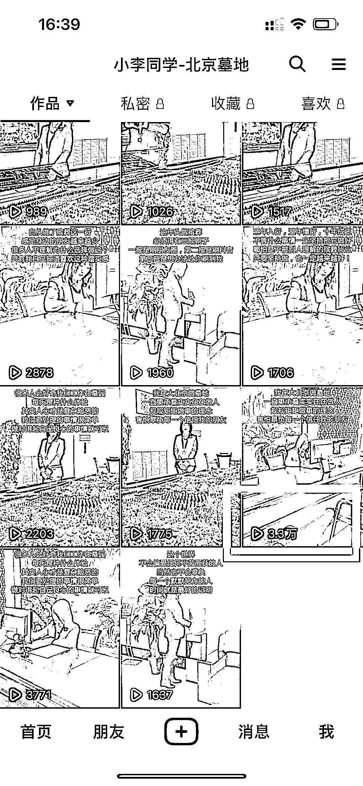

# 在测试一个新玩法，用矩阵制作个人 IP 视频的方式，做房产、墓地、汽车等高客单价的引流

> 原文：[`www.yuque.com/for_lazy/xkrm14/pyrnbf6yokkaxyiv`](https://www.yuque.com/for_lazy/xkrm14/pyrnbf6yokkaxyiv)

作者： 麦格雷皮 

日期：2023-01-05 

点赞数：26 

最近在测试一个新玩法，用矩阵制作个人 IP 视频的方式，做房产、墓地、汽车等高客单价的引流。这种方式核心逻辑是基于地理位置发电子传单，方圆几公里范围内基于兴趣爱好搜索等进行分发。只要我视频成本足够低，而且视频质量 OK，就能获取至少 500 以上的流量，矩阵起来发布就比较流量可观。目前做了几个账号，均已经有几个客咨，虽然目前尚未成交，但是感觉有数据积累就问题不大。后期变现，可以卖给开发商，陵园，4S 店等。 

 

 

