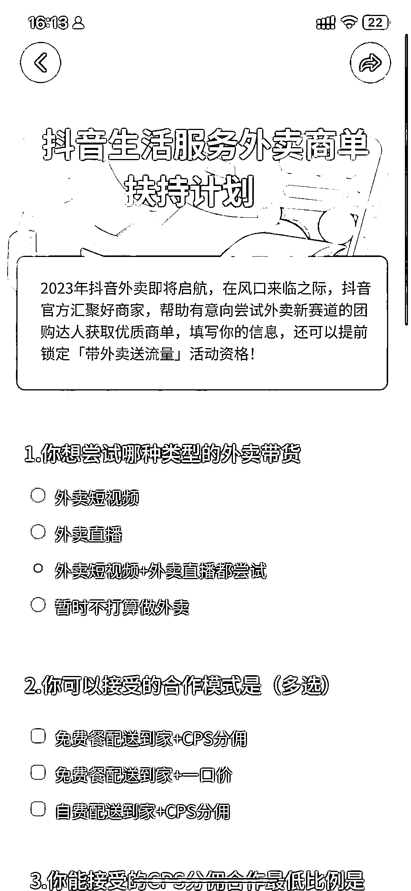
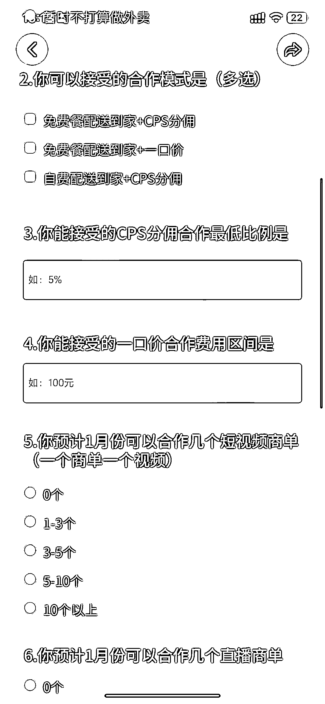

# 抖音本地生活服务-外卖上线，已经定向邀请达人报名

> 原文：[`www.yuque.com/for_lazy/xkrm14/rt98e3oqud4sgezs`](https://www.yuque.com/for_lazy/xkrm14/rt98e3oqud4sgezs)

<ne-p id="ued8d5739" data-lake-id="ued8d5739"><ne-text id="u121a968e">作者： HEXIN</ne-text></ne-p> <ne-p id="uc050c682" data-lake-id="uc050c682"><ne-text id="uc03a211f">日期：2023-01-04</ne-text></ne-p> <ne-p id="u105367b4" data-lake-id="u105367b4"><ne-text id="u5a1351cc">点赞数：</ne-text><ne-text id="ue78d133f" ne-bold="true">14</ne-text></ne-p> <ne-hole id="u59bdf3a1" data-lake-id="u59bdf3a1"><ne-card data-card-name="hr" data-card-type="block" id="tjLwL" data-event-boundary="card"><ne-p id="uaef77ecf" data-lake-id="uaef77ecf"><ne-text id="udac2d016">抖音本地生活服务-外卖准备上线，今天已经定向邀请达人报名，并且做一些调研信息，主要是看达人的诉求，再给推荐对应商单和流量资源。</ne-text></ne-p> <ne-p id="u0889516e" data-lake-id="u0889516e"><ne-card data-card-name="image" data-card-type="inline" id="uKvdV" data-event-boundary="card"></ne-card></ne-p> <ne-p id="ua5b14c26" data-lake-id="ua5b14c26"><ne-card data-card-name="image" data-card-type="inline" id="wo0XS" data-event-boundary="card"></ne-card></ne-p> <ne-p id="ub88c0755" data-lake-id="ub88c0755"><ne-card data-card-name="image" data-card-type="inline" id="Wnrlw" data-event-boundary="card"></ne-card></ne-p> <ne-hole id="ue13b5cac" data-lake-id="ue13b5cac"><ne-card data-card-name="hr" data-card-type="block" id="bvnaz" data-event-boundary="card"><ne-p id="ud6e12fb6" data-lake-id="ud6e12fb6"><ne-text id="u7c1ccd91">公众号懒人找资源，懒人专属群分享</ne-text></ne-p></ne-card></ne-hole></ne-card></ne-hole>