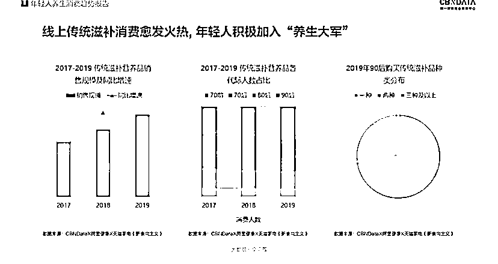

# 疫情后，人们对养生、健康方面的关注越来越高，养生滋补，药食同源方面产品需求尤为增长明显

> 原文：[`www.yuque.com/for_lazy/xkrm14/wm1cdtv3qkluemxg`](https://www.yuque.com/for_lazy/xkrm14/wm1cdtv3qkluemxg)

作者： 七宿君 

日期：2023-01-04 

点赞数：27 

一个深耕养生领域的趋势洞见观察 疫情之后，人们对养生，健康方面的关注越来越高，养生意识也越来越强，养生滋补，药食同源方面产品需求尤为增长明显，中医崛起复兴也是巨大推动力量，想做养生方面的可以关注这个赛道，是个比较不错的市场，这边做这个也是深有感触，大的市场需求一定会产生大的商业机会，任何一个趋势性行业都建立在“大量需求”的基础之上 

 

 

