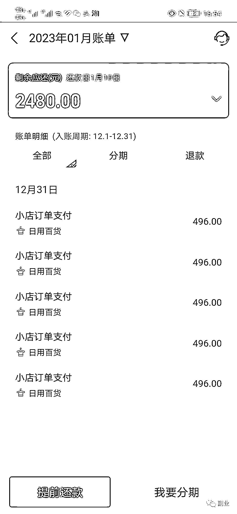
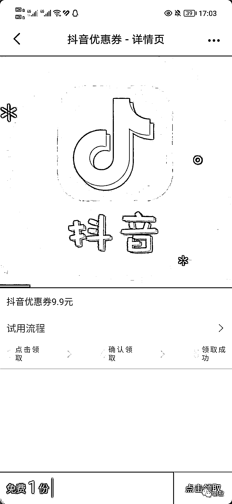

# 发一个最近的骗局，很多人上当了，就是看到兼职这种信息，加了好友，去做这个赚钱小任务

> 原文：[`www.yuque.com/for_lazy/xkrm14/vyd1lvohulrvvtco`](https://www.yuque.com/for_lazy/xkrm14/vyd1lvohulrvvtco)

作者： 一个人看夕阳 

日期：2023-01-04 

点赞数：16 

发一个最近的骗局，很多人上当了 这两天就有不少伙伴被骗好几千，钱怎么没的都不知道。 就是看到兼职这种信息，加了好友，去做这个赚钱小任务。你通过扫描对方提供的码，就跳转到支付宝，对方还宣称就是领取一个优惠券（图 2），属于正常操作，其实就是把你的支付宝绑定他们自己的自动代扣或者是续费的产品，设置成免密支付，然后就源源不断的扣除你账户的钱。 

最主要问题是，这种被骗，你无从投诉和补救回来，直接信息全部拉黑，人都联系不上。别人把订单一删除，申请退款也没用。想想确实可怕。都是有准备而来，利用规则漏洞，就怕你不做，一做就上当！ 

  

 

  

