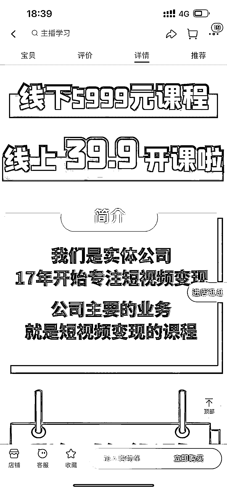
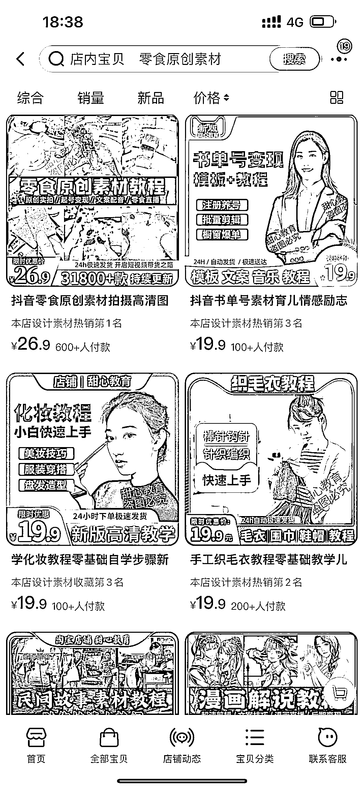

# 淘宝上打着卖素材的名义，实际要加老师看课程领取，跟素材和低价课程引流一个套路

> 原文：[`www.yuque.com/for_lazy/xkrm14/inzdw8dg4yog6sil`](https://www.yuque.com/for_lazy/xkrm14/inzdw8dg4yog6sil)

<ne-p id="u5aa6bd45" data-lake-id="u5aa6bd45"><ne-text id="u7d997ce3">作者： 姬小光</ne-text></ne-p> <ne-p id="u47fa6583" data-lake-id="u47fa6583"><ne-text id="ucf61cf34">日期：2023-01-04</ne-text></ne-p> <ne-p id="u398a8097" data-lake-id="u398a8097"><ne-text id="u5c23d78d">点赞数：</ne-text><ne-text id="u2a66802c" ne-bold="true">10</ne-text></ne-p> <ne-hole id="uda7d1838" data-lake-id="uda7d1838"><ne-card data-card-name="hr" data-card-type="block" id="Bqvk2" data-event-boundary="card"><ne-p id="ub9bc0799" data-lake-id="ub9bc0799"><ne-text id="u838dc520">淘宝上打着卖素材的名义，实际要加老师看课程领取，跟素材和低价钩子课程引流一个套路。但是在淘宝上看起来还是可以直接买素材，体感不太一样，转化应该更容易，抱着给我素材就行的心态，搞不好就买个大课[偷笑]</ne-text></ne-p> <ne-p id="uda695830" data-lake-id="uda695830"><ne-card data-card-name="image" data-card-type="inline" id="RZoIp" data-event-boundary="card"></ne-card></ne-p> <ne-p id="u2faf8b4a" data-lake-id="u2faf8b4a"><ne-card data-card-name="image" data-card-type="inline" id="OX0Om" data-event-boundary="card"></ne-card></ne-p> <ne-p id="u9eb295ee" data-lake-id="u9eb295ee"><ne-card data-card-name="image" data-card-type="inline" id="Wt2e5" data-event-boundary="card"></ne-card></ne-p> <ne-p id="u90fea3ca" data-lake-id="u90fea3ca"><ne-card data-card-name="image" data-card-type="inline" id="Hg2zd" data-event-boundary="card"></ne-card></ne-p> <ne-hole id="u7e43b04a" data-lake-id="u7e43b04a"><ne-card data-card-name="hr" data-card-type="block" id="P0h6Q" data-event-boundary="card"><ne-p id="u6b1085c7" data-lake-id="u6b1085c7"><ne-text id="ubf75b968">公众号懒人找资源，懒人专属群分享</ne-text></ne-p></ne-card></ne-hole></ne-card></ne-hole>