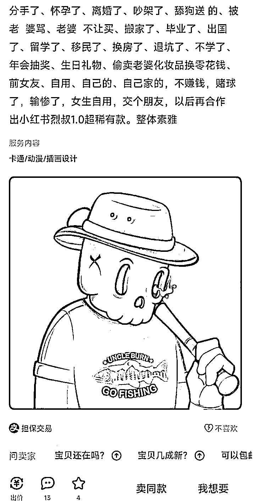

# 闲鱼上用的高频关键词合集

> 原文：[`www.yuque.com/for_lazy/xkrm14/qfwmc2t8kbqomp4p`](https://www.yuque.com/for_lazy/xkrm14/qfwmc2t8kbqomp4p)

作者： 田新一 

日期：2023-01-04 

点赞数：19 

闲鱼上用的高频关键词：分手了、怀孕了、离婚了、吵架了、舔狗送 的、被老  婆骂、老婆  不让买、搬家了、毕业了、出国了、留学了、移民了、换房了、退坑了、不学了、年会抽奖、生日礼物、偷卖老婆化妆品换零花钱、前女友、自用、自己的、自己家的，不赚钱，赌球了，输惨了，女生自用，交个朋友，以后再合作 

  

