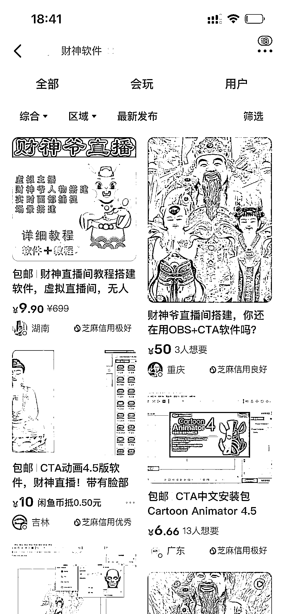

# 分享个前段时间做财神培训引流的玩法

> 原文：[`www.yuque.com/for_lazy/xkrm14/pr7iugwsly3g4pen`](https://www.yuque.com/for_lazy/xkrm14/pr7iugwsly3g4pen)

作者： 凡灵逸尘 

日期：2023-01-03 

点赞数：25 

分享个前段时间做财神培训引流的玩法 

一朋友做财神培训，除了在抖音上引流之外，还可以在闲鱼上进行引流，实现这种效果的一种是电脑版本的 CAT，一种是苹果的 Mug life 。 

Cat 需要用电脑且操作复杂效果不好，而 Mug life 这个软件需要美国银行卡，因此把闲鱼当作引流渠道，在闲鱼卖软件引流。 

然后再把客户引导到私域上，进行培训转化，客户非常的精准。而且哪怕转化不成功也可以卖软件挣钱，Cat 没成本，Mug life 的边际成本几乎为零且存在信息差，因为这个渠道不容易找。 

 

 

  

