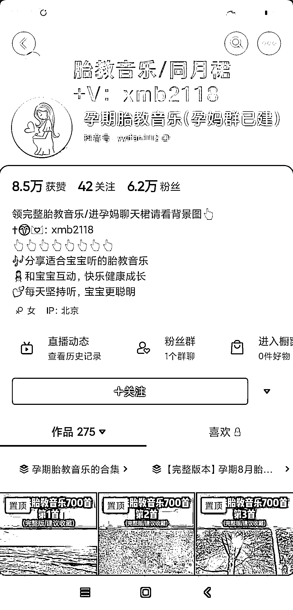

# 抖音 seo 案例，利用合集提高关键词权重然后账号设置引流信息

> 原文：[`www.yuque.com/for_lazy/xkrm14/zrsa5e9oq5v30kga`](https://www.yuque.com/for_lazy/xkrm14/zrsa5e9oq5v30kga)

<ne-p id="u1352abbf" data-lake-id="u1352abbf"><ne-text id="ud5e1b4b6">作者： 阿 Lin</ne-text></ne-p> <ne-p id="u6ccf5c4c" data-lake-id="u6ccf5c4c"><ne-text id="u3bb32e4a">日期：2022-12-27</ne-text></ne-p> <ne-p id="u7920ac58" data-lake-id="u7920ac58"><ne-text id="ueb7b6e19">点赞数：</ne-text><ne-text id="ub173e37a" ne-bold="true">21</ne-text></ne-p> <ne-hole id="udec4b14c" data-lake-id="udec4b14c"><ne-card data-card-name="hr" data-card-type="block" id="yxDjy" data-event-boundary="card"><ne-p id="u3d241b2c" data-lake-id="u3d241b2c"><ne-text id="u62de6d86">分享一个抖音 seo 案例，利用合集提高关键词权重然后账号设置引流信息。</ne-text></ne-p> <ne-p id="uf5d965dc" data-lake-id="uf5d965dc"><ne-card data-card-name="image" data-card-type="inline" id="pkqfV" data-event-boundary="card"></ne-card></ne-p> <ne-p id="u8e6f9cca" data-lake-id="u8e6f9cca"><ne-card data-card-name="image" data-card-type="inline" id="na5pO" data-event-boundary="card"></ne-card></ne-p> <ne-hole id="u9da11a01" data-lake-id="u9da11a01"><ne-card data-card-name="hr" data-card-type="block" id="rMXCk" data-event-boundary="card"><ne-p id="u0b796753" data-lake-id="u0b796753"><ne-text id="ud7a6ccdc">公众号懒人找资源，懒人专属群分享</ne-text></ne-p></ne-card></ne-hole></ne-card></ne-hole>