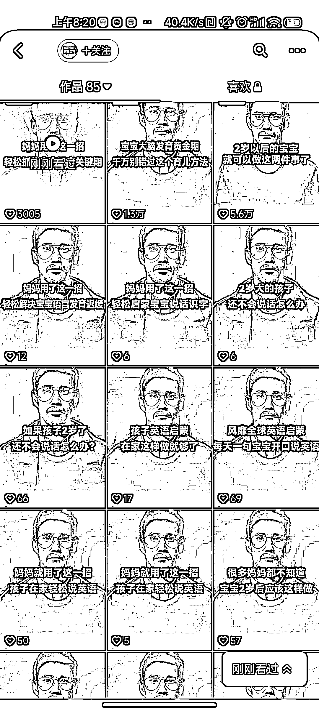

# 抖音视频，通过 ai 方式制作的垂直类视频，用英语的形式表达再翻译

> 原文：[`www.yuque.com/for_lazy/xkrm14/byuxrawh5bkhz5ix`](https://www.yuque.com/for_lazy/xkrm14/byuxrawh5bkhz5ix)

<ne-p id="uba2d9470" data-lake-id="uba2d9470"><ne-text id="ube26b36f">作者： 福猫</ne-text></ne-p> <ne-p id="ue9d7a708" data-lake-id="ue9d7a708"><ne-text id="u67ca73bc">日期：2022-12-28</ne-text></ne-p> <ne-p id="uffe05871" data-lake-id="uffe05871"><ne-text id="u33d76e5b">点赞数：</ne-text><ne-text id="uf6fb7abe" ne-bold="true">30</ne-text></ne-p> <ne-hole id="u3a663ee2" data-lake-id="u3a663ee2"><ne-card data-card-name="hr" data-card-type="block" id="SGQP0" data-event-boundary="card"><ne-p id="u5c796832" data-lake-id="u5c796832"><ne-text id="ud131f331">抖音上看到不少这样的视频，实际通过 ai 方式制作的垂直类视频，用英语的形式表达再翻译，从而大大提升信任度，因为有些人群就认为国外专家说的对</ne-text></ne-p> <ne-p id="u873cd7b5" data-lake-id="u873cd7b5"><ne-card data-card-name="image" data-card-type="inline" id="JFy67" data-event-boundary="card">  <ne-p id="u09b36abc" data-lake-id="u09b36abc"><ne-card data-card-name="image" data-card-type="inline" id="zV49Z" data-event-boundary="card"></ne-card></ne-p> <ne-hole id="u27c70c9b" data-lake-id="u27c70c9b"><ne-card data-card-name="hr" data-card-type="block" id="aOkMm" data-event-boundary="card"><ne-p id="u5ff25498" data-lake-id="u5ff25498"><ne-text id="u90fc1f31">公众号懒人找资源，懒人专属群分享</ne-text></ne-p></ne-card></ne-hole></ne-card></ne-p></ne-card></ne-hole>