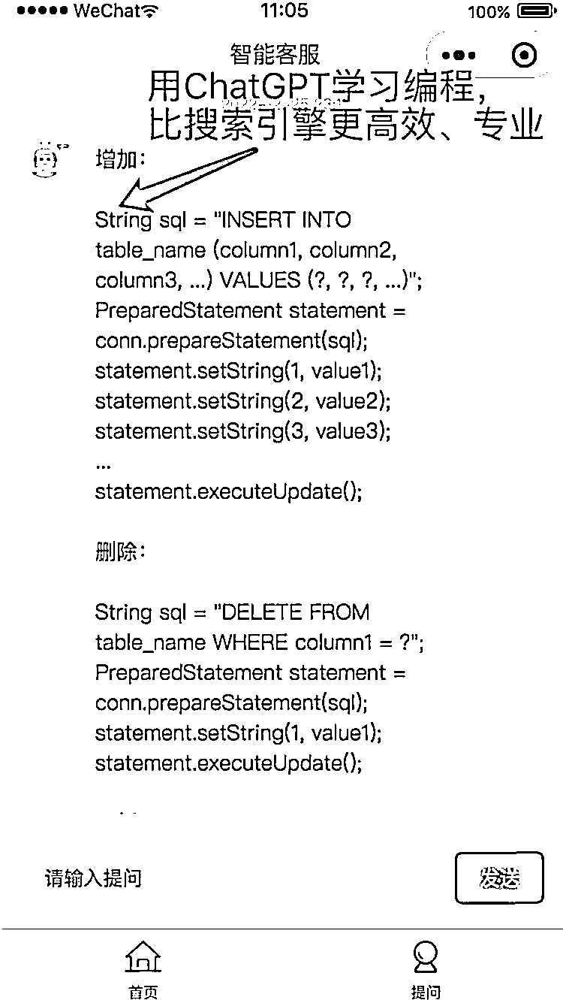

# 做了几个 ChatGPT 付费问答的小程序，目前每天几百笔付费订单

> 原文：[`www.yuque.com/for_lazy/xkrm14/ingfubudupr8t37r`](https://www.yuque.com/for_lazy/xkrm14/ingfubudupr8t37r)

作者： 码叔编程 

日期：2022-12-26 

点赞数：20 

做了几个 ChatGPT 付费问答的小程序，目前每天几百笔付费订单，发现有一部分人群是大学生群体，有学医、学法律、学计算机的等等，用 ChatGPT 来代替百度搜索功能，寻找问题解决方案，辅助学习。 

有大学生流量的圈友，可以试一下 ChatGPT 付费问答小程序变现，多交流。 

 

