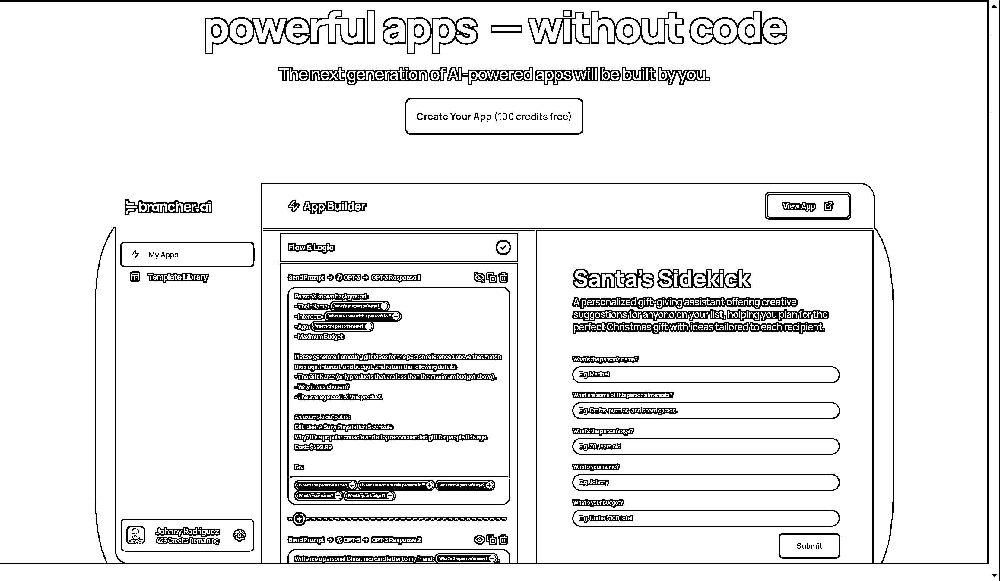
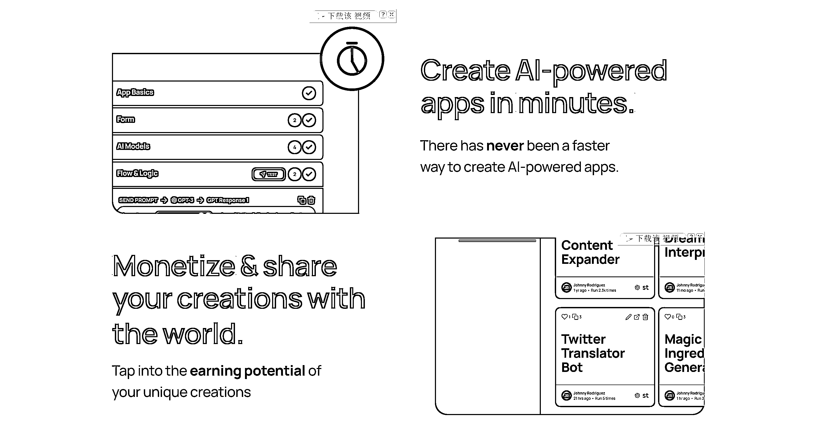
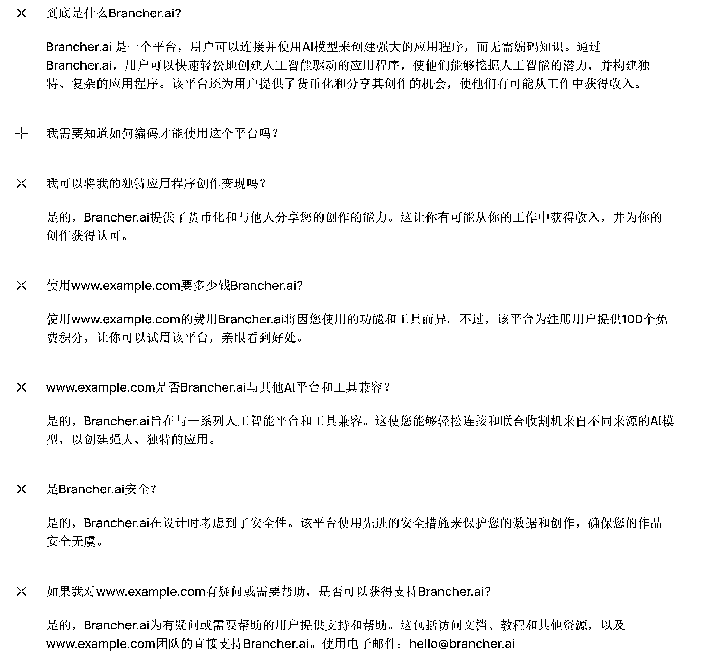

# 无需编码知识，快速创建人工智能驱动的程序

> 原文：[`www.yuque.com/for_lazy/xkrm14/ue2xfvmubc2csymo`](https://www.yuque.com/for_lazy/xkrm14/ue2xfvmubc2csymo)

<ne-p id="udf86b74d" data-lake-id="udf86b74d"><ne-text id="u335a2c6b">作者： Aimmon</ne-text></ne-p> <ne-p id="u48691724" data-lake-id="u48691724"><ne-text id="uac244bdd">日期：2022-12-27</ne-text></ne-p> <ne-p id="ud1a6dd3b" data-lake-id="ud1a6dd3b"><ne-text id="u9bdc7299">点赞数：</ne-text><ne-text id="udd76f567" ne-bold="true">18</ne-text></ne-p> <ne-hole id="u249d7735" data-lake-id="u249d7735"><ne-card data-card-name="hr" data-card-type="block" id="lhGe5" data-event-boundary="card"><ne-p id="u2b2cb8fe" data-lake-id="u2b2cb8fe"><ne-text id="u01d0c21b">无需编码知识，快速创建人工智能驱动的程序</ne-text></ne-p> <ne-p id="u93ba0840" data-lake-id="u93ba0840"><ne-card data-card-name="image" data-card-type="inline" id="lbG1h" data-event-boundary="card"></ne-card></ne-p> <ne-p id="u442fefed" data-lake-id="u442fefed"><ne-card data-card-name="image" data-card-type="inline" id="jqvgw" data-event-boundary="card"></ne-card></ne-p> <ne-p id="uffad66cb" data-lake-id="uffad66cb"><ne-card data-card-name="image" data-card-type="inline" id="KT1MH" data-event-boundary="card"></ne-card></ne-p> <ne-p id="u05725833" data-lake-id="u05725833"><ne-card data-card-name="image" data-card-type="inline" id="elqeh" data-event-boundary="card"></ne-card></ne-p> <ne-p id="uff3c60bc" data-lake-id="uff3c60bc"><ne-card data-card-name="image" data-card-type="inline" id="tDWN1" data-event-boundary="card"></ne-card></ne-p> <ne-p id="u295813b3" data-lake-id="u295813b3"><ne-card data-card-name="image" data-card-type="inline" id="V66OZ" data-event-boundary="card"></ne-card></ne-p> <ne-hole id="u1342e973" data-lake-id="u1342e973"><ne-card data-card-name="hr" data-card-type="block" id="m4Pm3" data-event-boundary="card"><ne-p id="uad24038b" data-lake-id="uad24038b"><ne-text id="u29754ce8">公众号懒人找资源，懒人专属群分享</ne-text></ne-p></ne-card></ne-hole></ne-card></ne-hole>