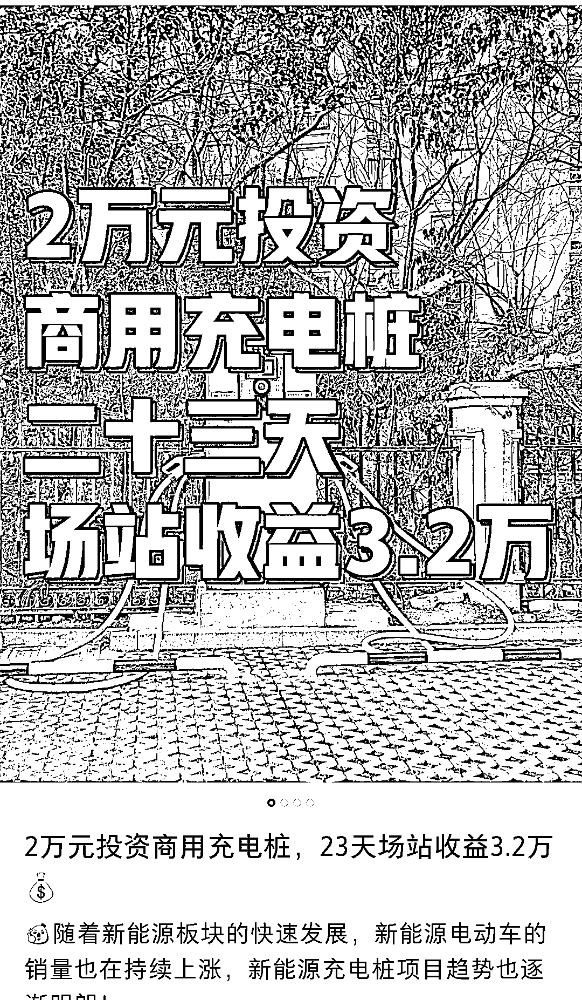
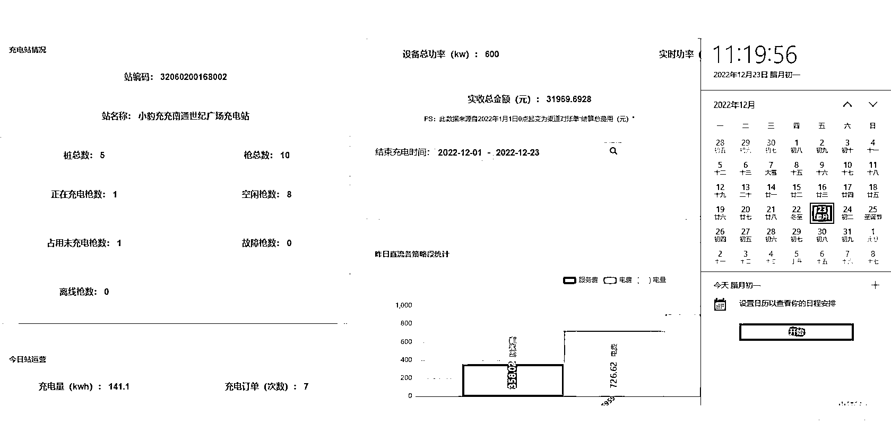

# 投资充电桩——未来可期的蓝海生意

> 原文：[`www.yuque.com/for_lazy/xkrm14/hmlhrbam2c1mm7n2`](https://www.yuque.com/for_lazy/xkrm14/hmlhrbam2c1mm7n2)

<ne-p id="u571ff429" data-lake-id="u571ff429"><ne-text id="u115fcca0">作者： may</ne-text></ne-p> <ne-p id="ue187e35f" data-lake-id="ue187e35f"><ne-text id="u201b91bd">日期：2022-12-28</ne-text></ne-p> <ne-p id="ude0bb1cd" data-lake-id="ude0bb1cd"><ne-text id="u235d7e5c">点赞数：</ne-text><ne-text id="u2a56bc8c" ne-bold="true">19</ne-text></ne-p> <ne-hole id="u0292c119" data-lake-id="u0292c119"><ne-card data-card-name="hr" data-card-type="block" id="excy9" data-event-boundary="card"><ne-p id="u2c91c323" data-lake-id="u2c91c323"><ne-text id="u1baa45d2">投资充电桩——未来可期的蓝海生意</ne-text></ne-p> <ne-p id="u14af550f" data-lake-id="u14af550f"><ne-card data-card-name="image" data-card-type="inline" id="dzlCB" data-event-boundary="card"></ne-card></ne-p> <ne-p id="u59018714" data-lake-id="u59018714"><ne-card data-card-name="image" data-card-type="inline" id="cqo5g" data-event-boundary="card"></ne-card></ne-p> <ne-p id="u925c9dee" data-lake-id="u925c9dee"><ne-card data-card-name="image" data-card-type="inline" id="FqrXw" data-event-boundary="card"></ne-card></ne-p> <ne-hole id="uc704261a" data-lake-id="uc704261a"><ne-card data-card-name="hr" data-card-type="block" id="zG2Sn" data-event-boundary="card"><ne-p id="ubbfa8d4f" data-lake-id="ubbfa8d4f"><ne-text id="u9871f543">公众号懒人找资源，懒人专属群分享</ne-text></ne-p></ne-card></ne-hole></ne-card></ne-hole>