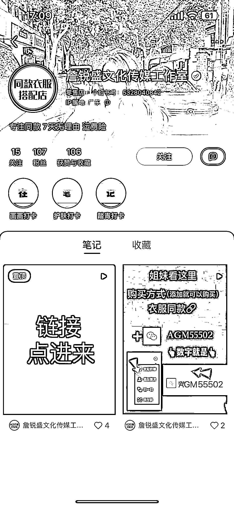

# 在小红书穿衣搭配的评论内容中，回复“求衣服链接”用户，引流到个人主页

> 原文：[`www.yuque.com/for_lazy/xkrm14/lsqonrfe5vghdzyi`](https://www.yuque.com/for_lazy/xkrm14/lsqonrfe5vghdzyi)

<ne-p id="uf42c87de" data-lake-id="uf42c87de"><ne-text id="u50ff0f06">作者： Sunwei</ne-text></ne-p> <ne-p id="uebe62361" data-lake-id="uebe62361"><ne-text id="u3b5d7169">日期：2022-12-19</ne-text></ne-p> <ne-p id="u7891425d" data-lake-id="u7891425d"><ne-text id="u069258d8">点赞数：</ne-text><ne-text id="u3478d9f1" ne-bold="true">17</ne-text></ne-p> <ne-hole id="u62bf9caa" data-lake-id="u62bf9caa"><ne-card data-card-name="hr" data-card-type="block" id="DpPmP" data-event-boundary="card"><ne-p id="u34557341" data-lake-id="u34557341"><ne-text id="u1f801789">在小红书穿衣搭配的评论内容中，回复“求衣服链接”用户，引流到个人主页进而加到私域成交</ne-text> <ne-text id="u49dd0277">优势：精准女装用户，商品明确（可淘宝以图搜图），引到私域还能二次转化</ne-text></ne-p> <ne-p id="u02d78abe" data-lake-id="u02d78abe"><ne-card data-card-name="image" data-card-type="inline" id="zOkzz" data-event-boundary="card">  <ne-p id="ue4fb2ae0" data-lake-id="ue4fb2ae0"><ne-card data-card-name="image" data-card-type="inline" id="lfg3y" data-event-boundary="card">  <ne-hole id="uc70fa292" data-lake-id="uc70fa292"><ne-card data-card-name="hr" data-card-type="block" id="eDbve" data-event-boundary="card"><ne-p id="ue71238ab" data-lake-id="ue71238ab"><ne-text id="u7b568188">公众号懒人找资源，懒人专属群分享</ne-text></ne-p></ne-card></ne-hole></ne-card></ne-p></ne-card></ne-p></ne-card></ne-hole>