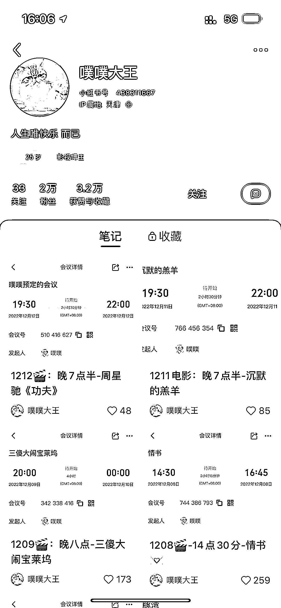

# 小红书上发现一种没见过的引流模式：通过线上观影拉人进腾讯会议

> 原文：[`www.yuque.com/for_lazy/xkrm14/iv9h5x6mpt9gcoig`](https://www.yuque.com/for_lazy/xkrm14/iv9h5x6mpt9gcoig)

<ne-p id="ued5e9850" data-lake-id="ued5e9850"><ne-text id="u296c6040">作者： 某人周</ne-text></ne-p> <ne-p id="ued8a2440" data-lake-id="ued8a2440"><ne-text id="u06df7fb8">日期：2022-12-19</ne-text></ne-p> <ne-p id="ue93b4088" data-lake-id="ue93b4088"><ne-text id="ubc208b59">点赞数：</ne-text><ne-text id="u3efde1d7" ne-bold="true">26</ne-text></ne-p> <ne-hole id="u6e71dae9" data-lake-id="u6e71dae9"><ne-card data-card-name="hr" data-card-type="block" id="zhuTh" data-event-boundary="card"><ne-p id="ubadd8c88" data-lake-id="ubadd8c88"><ne-text id="ud89ffbbd">在小红书上发现一种没见过的引流模式：通过线上观影拉人进腾讯会议。</ne-text></ne-p> <ne-p id="u54c8a2c5" data-lake-id="u54c8a2c5"><ne-text id="u84e7f6e4">突出一个真诚，电影是豆瓣排行榜比较靠前的精品，会议号直接放出来不怕违规。</ne-text></ne-p> <ne-p id="u5d37b3e2" data-lake-id="u5d37b3e2"><ne-text id="ube823f35">看电影的时候忘了截图了[捂脸] 看电影大家都没开摄像头，人均社恐，电影就是网上找的资源，搜磁力链接就有的那种，开头和结尾会放微信号拉群，以便约下次看电影的时间和选电影。</ne-text></ne-p> <ne-p id="uafe8013d" data-lake-id="uafe8013d"><ne-text id="u8146aba0">可以推广到其他平台比如豆瓣，抖音，最右，引流来的目测是年轻人，但标签不怎么精准，优质电影的受众太广了。</ne-text></ne-p> <ne-p id="ub8d080ad" data-lake-id="ub8d080ad"><ne-card data-card-name="image" data-card-type="inline" id="Eacxf" data-event-boundary="card"></ne-card></ne-p> <ne-p id="udbfb5e6e" data-lake-id="udbfb5e6e"><ne-card data-card-name="image" data-card-type="inline" id="y3XU3" data-event-boundary="card"></ne-card></ne-p> <ne-hole id="uf7df7483" data-lake-id="uf7df7483"><ne-card data-card-name="hr" data-card-type="block" id="hs4Sd" data-event-boundary="card"><ne-p id="u36fc4541" data-lake-id="u36fc4541"><ne-text id="ufec10d64">公众号懒人找资源，懒人专属群分享</ne-text></ne-p></ne-card></ne-hole></ne-card></ne-hole>