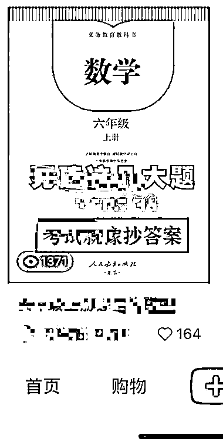

# 有一个作品在小红书中爆了就可以去多发同一个作品，做 IP 的不适用

> 原文：[`www.yuque.com/for_lazy/xkrm14/lzzqqnqffsie75q5`](https://www.yuque.com/for_lazy/xkrm14/lzzqqnqffsie75q5)

<ne-p id="ud803e13a" data-lake-id="ud803e13a"><ne-text id="ucc40d0c6">作者： 小攀师兄</ne-text></ne-p> <ne-p id="ub58fdd76" data-lake-id="ub58fdd76"><ne-text id="u06578bf6">日期：2022-12-19</ne-text></ne-p> <ne-p id="u7224a535" data-lake-id="u7224a535"><ne-text id="u6dc41c1a">点赞数：</ne-text><ne-text id="u04aee781" ne-bold="true">17</ne-text></ne-p> <ne-hole id="u7a06cc99" data-lake-id="u7a06cc99"><ne-card data-card-name="hr" data-card-type="block" id="Fcp4z" data-event-boundary="card"><ne-p id="u37524d79" data-lake-id="u37524d79"><ne-text id="u110bae5c">你有一个作品在小红书中爆了就可以去多发同一个作品，做到再爆，直到把流量给薅完，还可以尝试找到其他的爆款~</ne-text></ne-p> <ne-p id="u38863bde" data-lake-id="u38863bde"><ne-text id="u555a6211">做个人 ip 的就没必要吧，我们就是通过这个东西去不断地薅流量，可以去试试</ne-text></ne-p> <ne-p id="ucaba0448" data-lake-id="ucaba0448"><ne-card data-card-name="image" data-card-type="inline" id="IdWlz" data-event-boundary="card">  <ne-p id="u178536fd" data-lake-id="u178536fd"><ne-card data-card-name="image" data-card-type="inline" id="gDz29" data-event-boundary="card"></ne-card></ne-p> <ne-p id="u387110b2" data-lake-id="u387110b2"><ne-card data-card-name="image" data-card-type="inline" id="frPkQ" data-event-boundary="card"></ne-card></ne-p> <ne-hole id="u0d041c1c" data-lake-id="u0d041c1c"><ne-card data-card-name="hr" data-card-type="block" id="YeSjI" data-event-boundary="card"><ne-p id="u27716422" data-lake-id="u27716422"><ne-text id="ud26c73e0">公众号懒人找资源，懒人专属群分享</ne-text></ne-p></ne-card></ne-hole></ne-card></ne-p></ne-card></ne-hole>