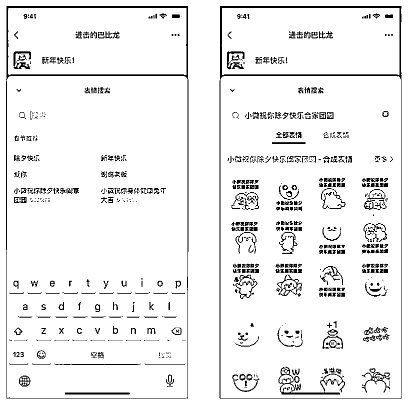

# 春节微信表情包开始征稿，可结合 AI 绘画多润色加工

> 原文：[`www.yuque.com/for_lazy/xkrm14/aqq0kigpaacy2u0y`](https://www.yuque.com/for_lazy/xkrm14/aqq0kigpaacy2u0y)

作者： 拾年（同路人） 

日期：2022-12-23 

点赞数：21 

⭐春节征稿 【参与要求】 1.参与方式：使用微信表情开放平台账号投稿。 2.投稿要求：投稿「表情专辑」或「表情单品」，投稿数量不做限制。 3.投稿时间：2022 年 12 月 23 日—2023 年 1 月 6 日。 

春节期间，参与活动的优秀表情作品将被推荐给可能感兴趣的微信用户，获得更多关注： ① 参与投稿的表情，当用户在聊天中搜索春节表情时，将会被优先展示。 ②当用户使用表情搜索推荐的专属祝福时，参与「合成表情」的作品将会获得额外曝光。 

如果你的作品上线成功，将会获得更多的流量和曝光。 

也可以结合 AI 绘画多润色加工一下，顺便可以开启表情包代画收费，专属表情包 vip 服务，收费教学社群等 

[春节征稿+|+HAPPY+NEW+YEAR+兔+YOU!](https://mp.weixin.qq.com/s/42CHwBWmobrobam6n2sZpA) 

 

