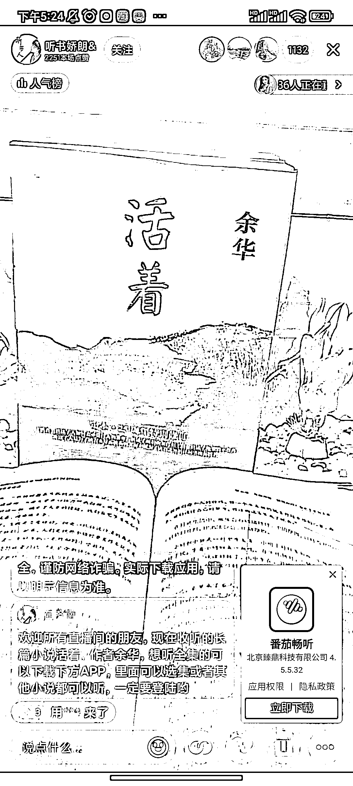

# 抖音直播引导下载番茄畅听，赚拉新的钱

> 原文：[`www.yuque.com/for_lazy/xkrm14/xe4ngxu9p3e4oq36`](https://www.yuque.com/for_lazy/xkrm14/xe4ngxu9p3e4oq36)

<ne-p id="u3c0ba673" data-lake-id="u3c0ba673"><ne-text id="ubfc121b2">作者： 清晨</ne-text></ne-p> <ne-p id="u9d31dec2" data-lake-id="u9d31dec2"><ne-text id="u161651c6">日期：2022-12-22</ne-text></ne-p> <ne-p id="u64ed445c" data-lake-id="u64ed445c"><ne-text id="u73695d90">点赞数：</ne-text><ne-text id="udc71cc74" ne-bold="true">20</ne-text></ne-p> <ne-hole id="u1e7137bc" data-lake-id="u1e7137bc"><ne-card data-card-name="hr" data-card-type="block" id="qvSvx" data-event-boundary="card"><ne-p id="uab7d3fc1" data-lake-id="uab7d3fc1"><ne-text id="u1b7304d0">抖音直播引导下载  番茄畅听  赚拉新的钱</ne-text></ne-p> <ne-p id="ud37073f5" data-lake-id="ud37073f5"><ne-card data-card-name="image" data-card-type="inline" id="KnVZz" data-event-boundary="card"></ne-card></ne-p> <ne-hole id="uf5eb85dd" data-lake-id="uf5eb85dd"><ne-card data-card-name="hr" data-card-type="block" id="ZPpsW" data-event-boundary="card"><ne-p id="u6f377698" data-lake-id="u6f377698"><ne-text id="ue06ad07e">公众号懒人找资源，懒人专属群分享</ne-text></ne-p></ne-card></ne-hole></ne-card></ne-hole>