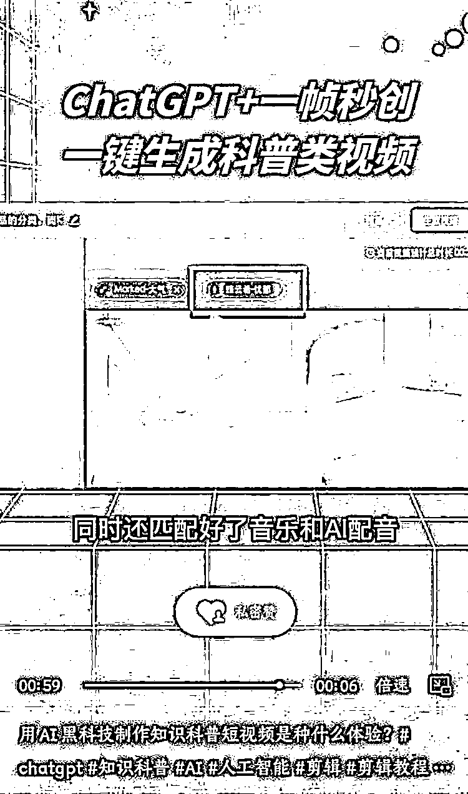

# ChatGPT+一帧秒传，一键生成科普类视频

> 原文：[`www.yuque.com/for_lazy/xkrm14/vb3i061sf1nlvp5p`](https://www.yuque.com/for_lazy/xkrm14/vb3i061sf1nlvp5p)

<ne-p id="u7bc5a6a6" data-lake-id="u7bc5a6a6"><ne-text id="u2e68b098">作者： 七哥个人品牌</ne-text></ne-p> <ne-p id="uf0ee9c80" data-lake-id="uf0ee9c80"><ne-text id="u1d26f452">日期：2022-12-19</ne-text></ne-p> <ne-p id="u1ccbb470" data-lake-id="u1ccbb470"><ne-text id="u6ed0df54">点赞数：</ne-text><ne-text id="ub422d3f6" ne-bold="true">18</ne-text></ne-p> <ne-hole id="u12059ea3" data-lake-id="u12059ea3"><ne-card data-card-name="hr" data-card-type="block" id="Qk5as" data-event-boundary="card"><ne-p id="u9cf9f00d" data-lake-id="u9cf9f00d"><ne-text id="u565b6d69">15</ne-text></ne-p> <ne-p id="u5c8b1d39" data-lake-id="u5c8b1d39"><ne-text id="uc0f3fdb6">chatgpt+一帧秒传</ne-text></ne-p> <ne-p id="u5cc91aed" data-lake-id="u5cc91aed"><ne-text id="u557faaa9">赚钱点:</ne-text> <ne-text id="u4bd3aaba">1.利用 chatgpt:得到科普的知识点</ne-text></ne-p> <ne-p id="u67addaa0" data-lake-id="u67addaa0"><ne-text id="uca40076f">2.一帧秒传:用来将知识点转成图文视频形式，更加生动</ne-text></ne-p> <ne-p id="u718db870" data-lake-id="u718db870"><ne-text id="u786eb7d3">3.运用:批量化生产做账号</ne-text></ne-p> <ne-p id="u5bb6b9e5" data-lake-id="u5bb6b9e5"><ne-text id="udfa7c917">15</ne-text></ne-p> <ne-p id="u611b506c" data-lake-id="u611b506c"><ne-card data-card-name="image" data-card-type="inline" id="AqkF6" data-event-boundary="card"></ne-card></ne-p> <ne-hole id="u48782f0c" data-lake-id="u48782f0c"><ne-card data-card-name="hr" data-card-type="block" id="iZFiO" data-event-boundary="card"><ne-p id="u295f4185" data-lake-id="u295f4185"><ne-text id="ud8ca9196">公众号懒人找资源，懒人专属群分享</ne-text></ne-p></ne-card></ne-hole></ne-card></ne-hole>