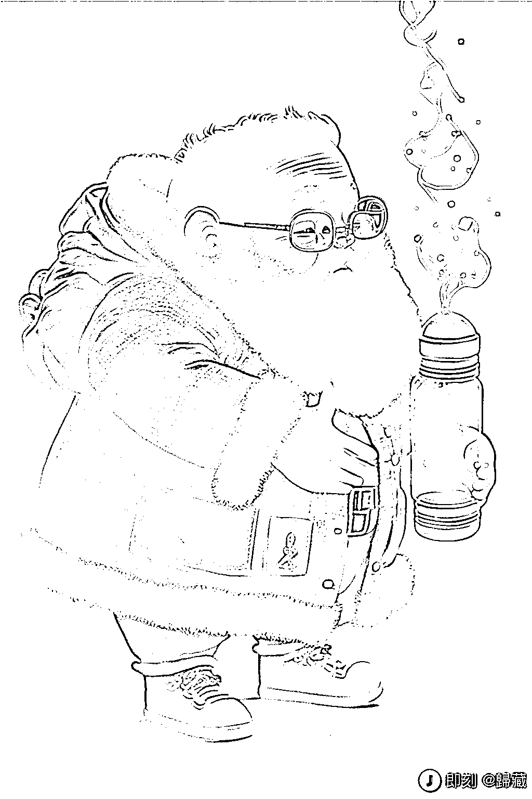

# AI 帮助生成 AI 提示词的功能终于有人产品化了

> 原文：[`www.yuque.com/for_lazy/xkrm14/now3x1xnk9xsi5hb`](https://www.yuque.com/for_lazy/xkrm14/now3x1xnk9xsi5hb)

<ne-p id="uecbd40c3" data-lake-id="uecbd40c3"><ne-text id="uc4927e0b">作者： 臻默</ne-text></ne-p> <ne-p id="u90837fbd" data-lake-id="u90837fbd"><ne-text id="ud07dccf4">日期：2022-12-22</ne-text></ne-p> <ne-p id="u329e2940" data-lake-id="u329e2940"><ne-text id="u2956f96e">点赞数：</ne-text><ne-text id="ue5c68929" ne-bold="true">28</ne-text></ne-p> <ne-hole id="u6073a2ed" data-lake-id="u6073a2ed"><ne-card data-card-name="hr" data-card-type="block" id="RwXzk" data-event-boundary="card"><ne-p id="ubdfda9b7" data-lake-id="ubdfda9b7"><ne-text id="u797f1cea">之前设想过的 AI 帮助生成 AI 提示词的功能终于有人产品化了。 你只需要输入一个 AI 绘图提示的主旨，这个模型将尝试帮你添加合适的风格提示。 下面的后面两张图是我试用的结果，效果挺好的。  </ne-text>[<ne-text id="u1faaed16">Prompt+Extend+-+a+Hugging+Face+Space+by+daspartho</ne-text>](https://huggingface.co/spaces/daspartho/prompt-extend)</ne-p> <ne-p id="u14a0160f" data-lake-id="u14a0160f"><ne-card data-card-name="image" data-card-type="inline" id="uIodl" data-event-boundary="card"></ne-card></ne-p> <ne-p id="u14c9431c" data-lake-id="u14c9431c"><ne-card data-card-name="image" data-card-type="inline" id="HCB9j" data-event-boundary="card"></ne-card></ne-p> <ne-p id="ud7d5a0a0" data-lake-id="ud7d5a0a0"><ne-card data-card-name="image" data-card-type="inline" id="ZqO3y" data-event-boundary="card"></ne-card></ne-p> <ne-hole id="u48b0988d" data-lake-id="u48b0988d"><ne-card data-card-name="hr" data-card-type="block" id="ToWo3" data-event-boundary="card"><ne-p id="ue63fbd21" data-lake-id="ue63fbd21"><ne-text id="uc78974a3">公众号懒人找资源，懒人专属群分享</ne-text></ne-p></ne-card></ne-hole></ne-card></ne-hole>