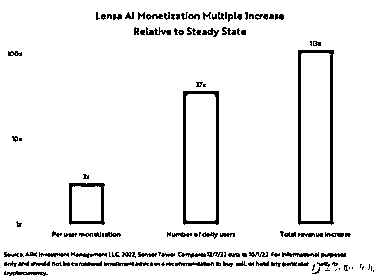

# Magic Avatar 推出的三周以来，Lensa AI 在 iOS 的年化收入增长了约 100X

> 原文：[`www.yuque.com/for_lazy/xkrm14/knmmcri11upuk9dt`](https://www.yuque.com/for_lazy/xkrm14/knmmcri11upuk9dt)

<ne-p id="u5139412d" data-lake-id="u5139412d"><ne-text id="u596e2110">作者： 蓝弈</ne-text></ne-p> <ne-p id="ua163b474" data-lake-id="ua163b474"><ne-text id="uc9138bbe">日期：2022-12-23</ne-text></ne-p> <ne-p id="u47ffac73" data-lake-id="u47ffac73"><ne-text id="u2fe53c31">点赞数：</ne-text><ne-text id="u6794b52b" ne-bold="true">15</ne-text></ne-p> <ne-hole id="u20b23767" data-lake-id="u20b23767"><ne-card data-card-name="hr" data-card-type="block" id="Jk2gs" data-event-boundary="card"><ne-p id="u83464de8" data-lake-id="u83464de8"><ne-text id="uc1109092">自 Magic Avatar 推出的三周以来，Lensa AI 在 iOS 的年化收入增长了约 100X（从 1000 万美金到 12 亿美金），其中：日活增长了 37X，ARPU 增长了 3X。</ne-text></ne-p> <ne-p id="ube619585" data-lake-id="ube619585">[<ne-text id="u15278a58">Artificial+Intelligence+Archives+-+ARK+Invest</ne-text>](https://ark-invest.com/search-tags/artificial-intelligence/)</ne-p> <ne-p id="u37100880" data-lake-id="u37100880"><ne-card data-card-name="image" data-card-type="inline" id="oUjuR" data-event-boundary="card">  <ne-p id="u4bce88c9" data-lake-id="u4bce88c9"><ne-card data-card-name="image" data-card-type="inline" id="fgLja" data-event-boundary="card">  <ne-hole id="u0fc55a51" data-lake-id="u0fc55a51"><ne-card data-card-name="hr" data-card-type="block" id="yhHpq" data-event-boundary="card"><ne-p id="u0680ebd8" data-lake-id="u0680ebd8"><ne-text id="u0349d51f">公众号懒人找资源，懒人专属群分享</ne-text></ne-p></ne-card></ne-hole></ne-card></ne-p></ne-card></ne-p></ne-card></ne-hole>