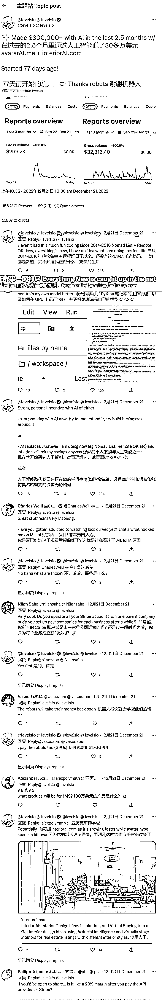

# 国外独立程序员利用 AI 风口，2 个产品在 77 天赚了 200+w

> 原文：[`www.yuque.com/for_lazy/xkrm14/ibx68u38rvwshnzu`](https://www.yuque.com/for_lazy/xkrm14/ibx68u38rvwshnzu)

<ne-p id="u58998f99" data-lake-id="u58998f99"><ne-text id="u4dc52079">作者： AM</ne-text></ne-p> <ne-p id="u736e6023" data-lake-id="u736e6023"><ne-text id="u31b0b053">日期：2022-12-22</ne-text></ne-p> <ne-p id="ua643c8e9" data-lake-id="ua643c8e9"><ne-text id="ucfce01e4">点赞数：</ne-text><ne-text id="u7ad10a56" ne-bold="true">25</ne-text></ne-p> <ne-hole id="ub2c25066" data-lake-id="ub2c25066"><ne-card data-card-name="hr" data-card-type="block" id="thrl1" data-event-boundary="card"><ne-p id="ue535e574" data-lake-id="ue535e574"><ne-text id="u8303d3be">国外独立程序员利用 AI 风口,2 个产品在 77 天赚了 200+w</ne-text> <ne-text id="u9c00c60f">1 个是利用 AI 生成多个头像和一个视频,  avatarAI.me</ne-text> <ne-text id="uee86c551">1 个是通过 AI 获取室内设计灵感 interiorAI.com</ne-text></ne-p> <ne-p id="ucade78b8" data-lake-id="ucade78b8"><ne-card data-card-name="image" data-card-type="inline" id="wrtNQ" data-event-boundary="card">  <ne-hole id="u5cbc0e9c" data-lake-id="u5cbc0e9c"><ne-card data-card-name="hr" data-card-type="block" id="MLkzE" data-event-boundary="card"><ne-p id="u6fb4b290" data-lake-id="u6fb4b290"><ne-text id="ucfcad62e">公众号懒人找资源，懒人专属群分享</ne-text></ne-p></ne-card></ne-hole></ne-card></ne-p></ne-card></ne-hole>