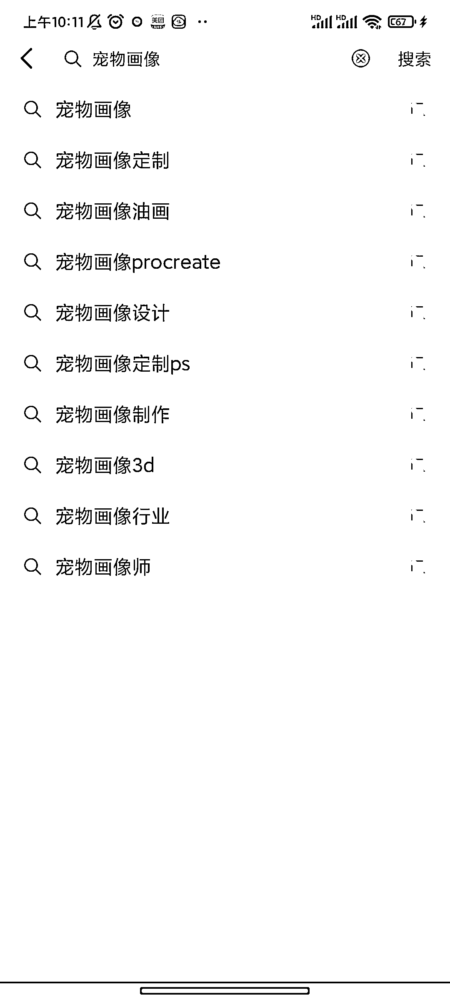
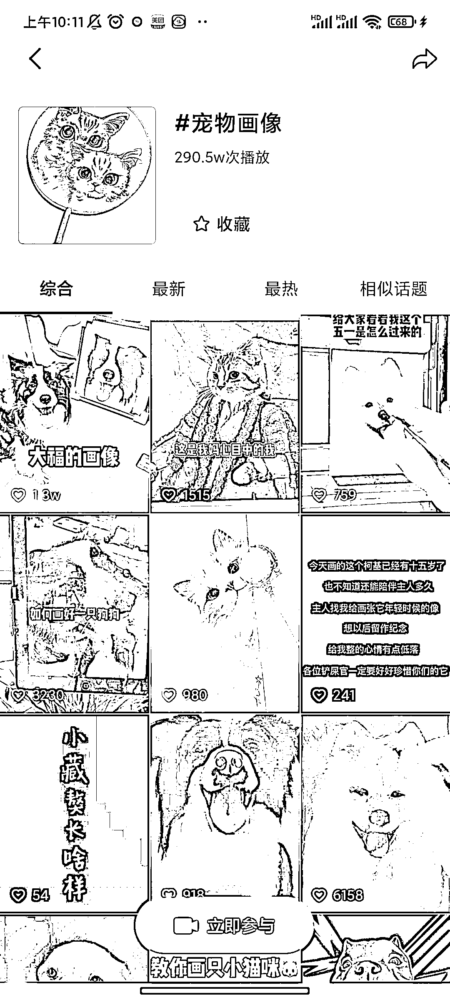
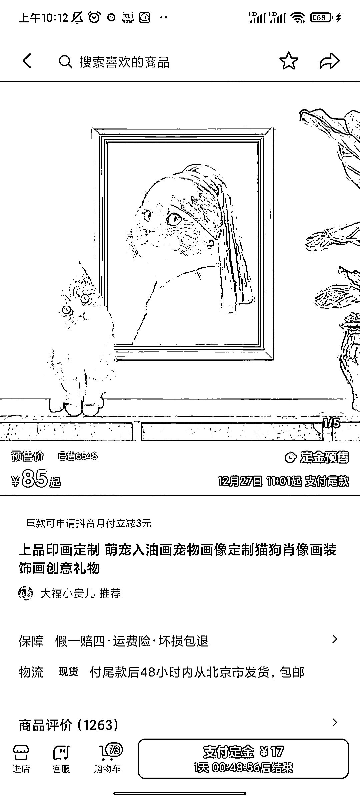

# 给宠物画像

> 原文：[`www.yuque.com/for_lazy/xkrm14/gkl5i2rin2fzvg0z`](https://www.yuque.com/for_lazy/xkrm14/gkl5i2rin2fzvg0z)

<ne-p id="u668c1969" data-lake-id="u668c1969"><ne-text id="uc5e87859">作者： 清晨</ne-text></ne-p> <ne-p id="u7ad09361" data-lake-id="u7ad09361"><ne-text id="u58617c45">日期：2022-12-23</ne-text></ne-p> <ne-p id="u5421d230" data-lake-id="u5421d230"><ne-text id="uaf5ab1e3">点赞数：</ne-text><ne-text id="ubf418c46" ne-bold="true">20</ne-text></ne-p> <ne-hole id="ufc85e828" data-lake-id="ufc85e828"><ne-card data-card-name="hr" data-card-type="block" id="eYoMU" data-event-boundary="card"><ne-p id="u964a1fde" data-lake-id="u964a1fde"><ne-text id="u0e721aed">给宠物画像</ne-text></ne-p> <ne-p id="u427e386d" data-lake-id="u427e386d"><ne-card data-card-name="image" data-card-type="inline" id="lNhD7" data-event-boundary="card"></ne-card></ne-p> <ne-p id="uc7dfedd6" data-lake-id="uc7dfedd6"><ne-card data-card-name="image" data-card-type="inline" id="F4v30" data-event-boundary="card"></ne-card></ne-p> <ne-p id="u6c9610cb" data-lake-id="u6c9610cb"><ne-card data-card-name="image" data-card-type="inline" id="OWcip" data-event-boundary="card"></ne-card></ne-p> <ne-hole id="u39d3fa16" data-lake-id="u39d3fa16"><ne-card data-card-name="hr" data-card-type="block" id="Bv3vF" data-event-boundary="card"><ne-p id="uc70cf2c5" data-lake-id="uc70cf2c5"><ne-text id="uab25eb49">公众号懒人找资源，懒人专属群分享</ne-text></ne-p></ne-card></ne-hole></ne-card></ne-hole>