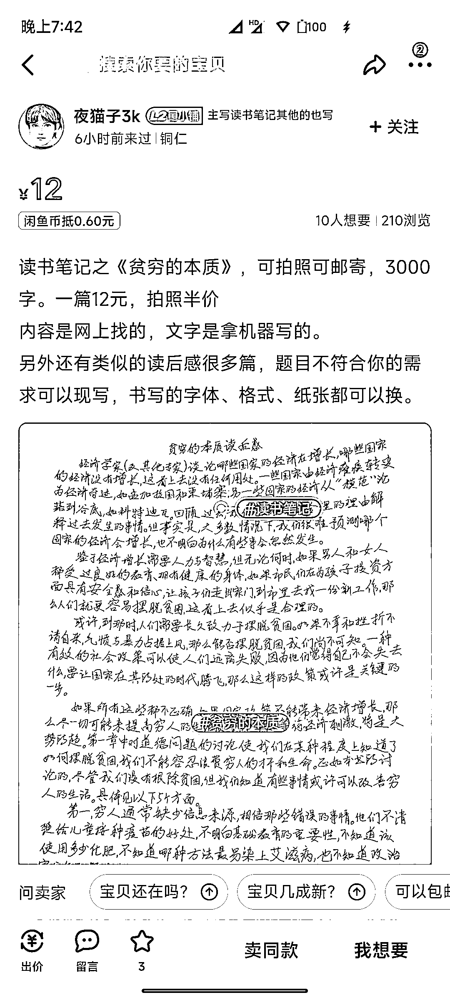

# 用读书笔记在咸鱼引流

> 原文：[`www.yuque.com/for_lazy/xkrm14/vtatm5q2k5clcton`](https://www.yuque.com/for_lazy/xkrm14/vtatm5q2k5clcton)

作者： 阿丰 

日期：2022-12-19 

点赞数：23 

用读书笔记在咸鱼引流 

很多人都知道咸鱼是个巨大的流量池，而热门书籍本身就自带热度。 

别人卖二手热门书，你卖读书笔记，价格可以设置很低，比如 1 到 5 块，这样通过价格排序就可以排在前面，同时用这个来引流。 

曝光量大、目标用户精准、排序有优势、引流效果杠杠的。 

 

 

