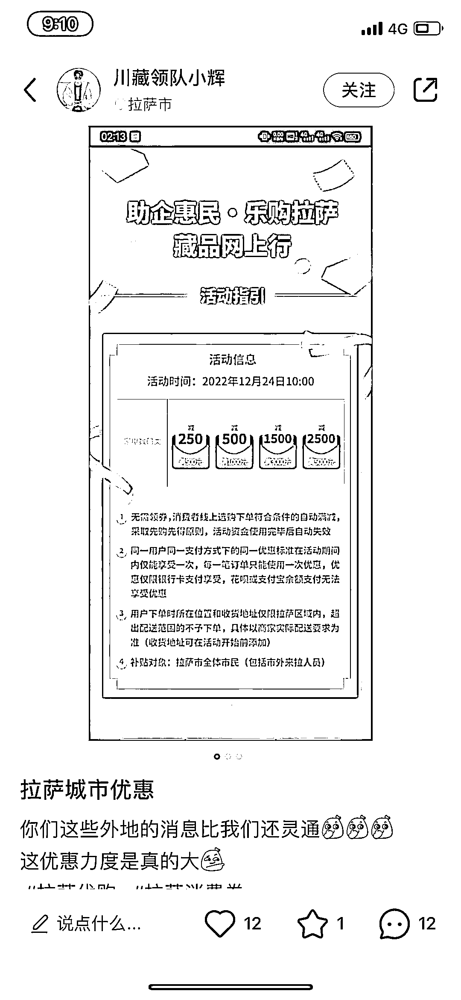
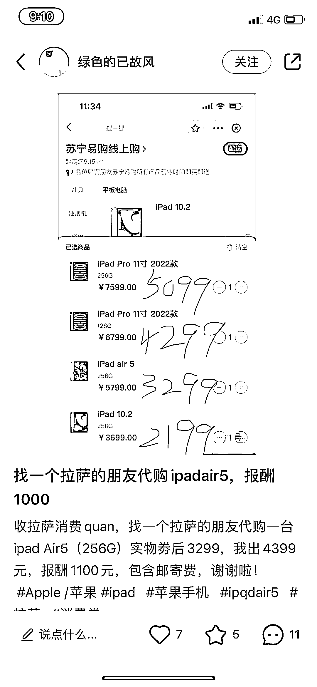

# 拉萨消费券，最大额满 5000 减 2500

> 原文：[`www.yuque.com/for_lazy/xkrm14/egf9gsc6rofgyud7`](https://www.yuque.com/for_lazy/xkrm14/egf9gsc6rofgyud7)

<ne-p id="u94280c09" data-lake-id="u94280c09"><ne-text id="ue8f2d023">作者： 郭二毛</ne-text></ne-p> <ne-p id="u0c2f342a" data-lake-id="u0c2f342a"><ne-text id="uc8e78289">日期：2022-12-23</ne-text></ne-p> <ne-p id="u0038b77a" data-lake-id="u0038b77a"><ne-text id="u7b567c64">点赞数：</ne-text><ne-text id="u0f7f9de7" ne-bold="true">14</ne-text></ne-p> <ne-hole id="u20509b86" data-lake-id="u20509b86"><ne-card data-card-name="hr" data-card-type="block" id="vJU0Y" data-event-boundary="card"><ne-p id="u7644a55b" data-lake-id="u7644a55b"><ne-text id="uc1426f84">新鲜出炉的拉萨消费券，最大额满 5000 减 2500，相当于半价，好多求购，报酬直接 1000 起步</ne-text></ne-p> <ne-p id="u387e153e" data-lake-id="u387e153e"><ne-card data-card-name="image" data-card-type="inline" id="ziKiH" data-event-boundary="card"></ne-card></ne-p> <ne-p id="uc11c7958" data-lake-id="uc11c7958"><ne-card data-card-name="image" data-card-type="inline" id="wKNuY" data-event-boundary="card"></ne-card></ne-p> <ne-hole id="ubaeba9b1" data-lake-id="ubaeba9b1"><ne-card data-card-name="hr" data-card-type="block" id="Fz1S5" data-event-boundary="card"><ne-p id="ubf3e7a9c" data-lake-id="ubf3e7a9c"><ne-text id="ucc02f988">公众号懒人找资源，懒人专属群分享</ne-text></ne-p></ne-card></ne-hole></ne-card></ne-hole>