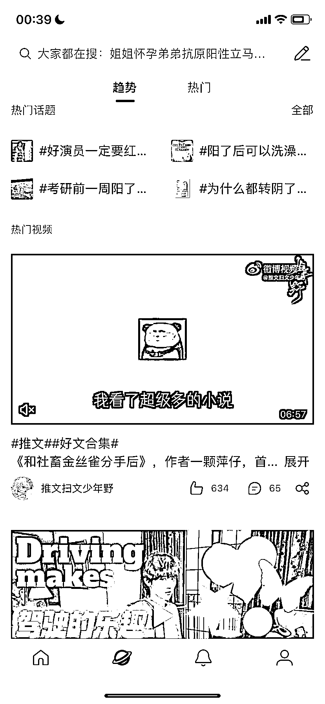

# 小说在微博、b 站布局，吸引的全是女性高粘度用户

> 原文：[`www.yuque.com/for_lazy/xkrm14/zv3chsdyhvufl4ib`](https://www.yuque.com/for_lazy/xkrm14/zv3chsdyhvufl4ib)

<ne-p id="ua4363d7c" data-lake-id="ua4363d7c"><ne-text id="u0e387984">作者： Believer</ne-text></ne-p> <ne-p id="u9dbbb76d" data-lake-id="u9dbbb76d"><ne-text id="ue499d81a">日期：2022-12-22</ne-text></ne-p> <ne-p id="uee1e77f8" data-lake-id="uee1e77f8"><ne-text id="u7d73f4f0">点赞数：</ne-text><ne-text id="ub075b3e0" ne-bold="true">30</ne-text></ne-p> <ne-hole id="ucc82cb93" data-lake-id="ucc82cb93"><ne-card data-card-name="hr" data-card-type="block" id="Q5W5h" data-event-boundary="card"><ne-p id="u6744ebef" data-lake-id="u6744ebef"><ne-text id="ufa2e817c">小说项目，大家都在卷抖音，完全忽视了在一些女性更多的平台，有人要悄悄发大财，例如下图中一个博主，在微博、b 站布局，吸引的全是女性高粘度用户</ne-text></ne-p> <ne-p id="u9fe36a5d" data-lake-id="u9fe36a5d"><ne-card data-card-name="image" data-card-type="inline" id="YdYKx" data-event-boundary="card"></ne-card></ne-p> <ne-p id="u5ba3fb26" data-lake-id="u5ba3fb26"><ne-card data-card-name="image" data-card-type="inline" id="zlzxQ" data-event-boundary="card"></ne-card></ne-p> <ne-p id="u6c2eea9d" data-lake-id="u6c2eea9d"><ne-card data-card-name="image" data-card-type="inline" id="L0AQZ" data-event-boundary="card"></ne-card></ne-p> <ne-hole id="u19e8c8c5" data-lake-id="u19e8c8c5"><ne-card data-card-name="hr" data-card-type="block" id="fTI8L" data-event-boundary="card"><ne-p id="u2db9c827" data-lake-id="u2db9c827"><ne-text id="uf006786d">公众号懒人找资源，懒人专属群分享</ne-text></ne-p></ne-card></ne-hole></ne-card></ne-hole>