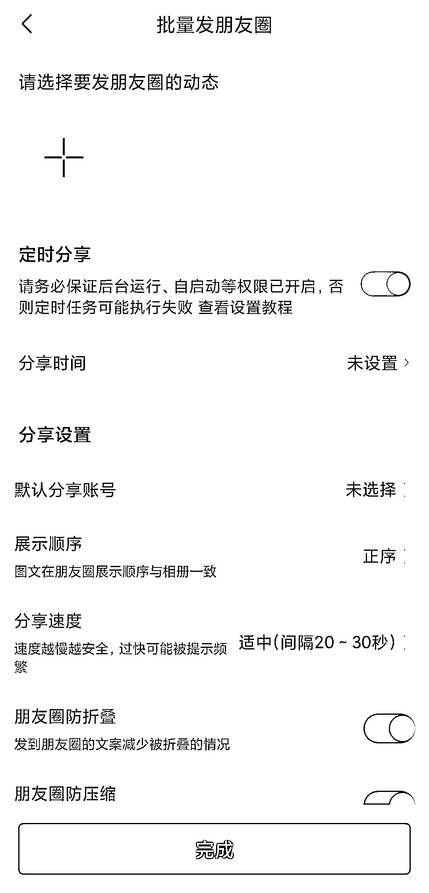

# 快团团 app，支持定时发朋友圈，抓取指定好友的朋友圈

> 原文：[`www.yuque.com/for_lazy/xkrm14/myq1ieblx2xe6kpr`](https://www.yuque.com/for_lazy/xkrm14/myq1ieblx2xe6kpr)

<ne-p id="u01767b37" data-lake-id="u01767b37"><ne-text id="udd57382d">作者： 麻雀</ne-text></ne-p> <ne-p id="u04b8c112" data-lake-id="u04b8c112"><ne-text id="u3b3e8d24">日期：2022-12-22</ne-text></ne-p> <ne-p id="u123c6768" data-lake-id="u123c6768"><ne-text id="u5bb208d0">点赞数：</ne-text><ne-text id="ue5933f82" ne-bold="true">23</ne-text></ne-p> <ne-hole id="u86f3622c" data-lake-id="u86f3622c"><ne-card data-card-name="hr" data-card-type="block" id="ZFcIo" data-event-boundary="card"><ne-p id="u00c38ecd" data-lake-id="u00c38ecd"><ne-text id="ud5ef7cda">快团团的 app，可以支持定时发朋友圈，抓取指定好友的朋友圈</ne-text></ne-p> <ne-p id="u261c3bfb" data-lake-id="u261c3bfb"><ne-card data-card-name="image" data-card-type="inline" id="ELF7i" data-event-boundary="card"></ne-card></ne-p> <ne-p id="u154e517d" data-lake-id="u154e517d"><ne-card data-card-name="image" data-card-type="inline" id="MXVOQ" data-event-boundary="card"></ne-card></ne-p> <ne-p id="ue9e1dcbb" data-lake-id="ue9e1dcbb"><ne-card data-card-name="image" data-card-type="inline" id="fc8J7" data-event-boundary="card"></ne-card></ne-p> <ne-hole id="uda25b972" data-lake-id="uda25b972"><ne-card data-card-name="hr" data-card-type="block" id="PqAzx" data-event-boundary="card"><ne-p id="ue9606ade" data-lake-id="ue9606ade"><ne-text id="uaca3f711">公众号懒人找资源，懒人专属群分享</ne-text></ne-p></ne-card></ne-hole></ne-card></ne-hole>