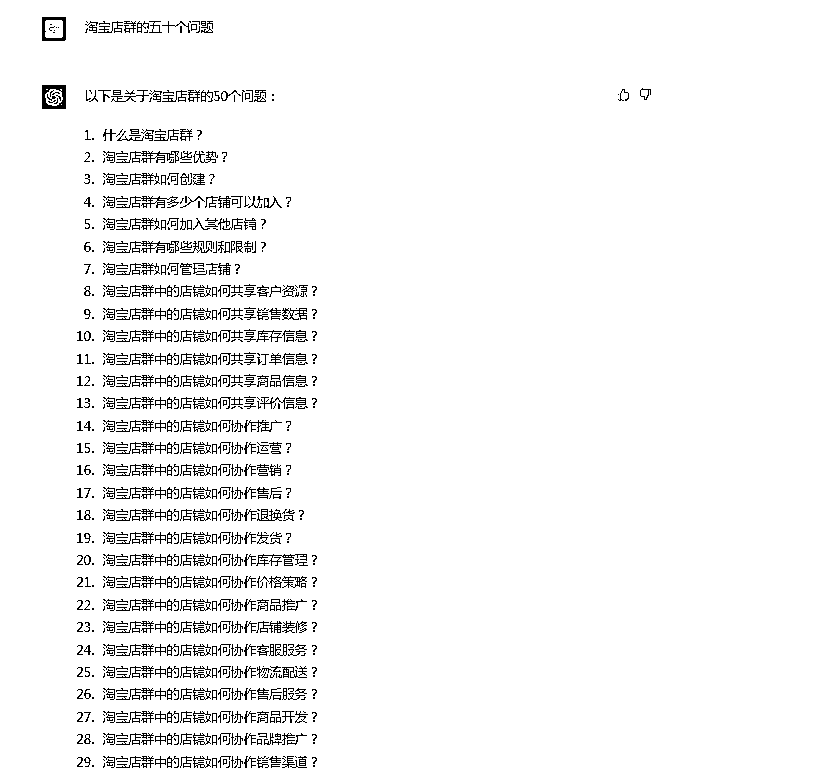
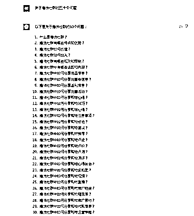
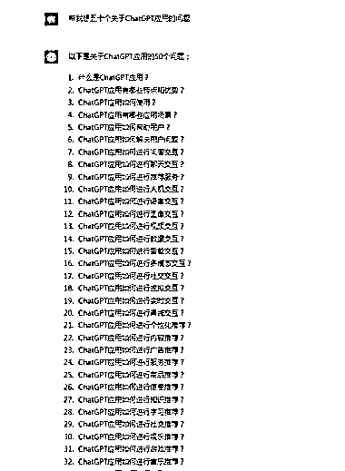

# Chatgpt 咨询领域相关问题，直播解答过程引流做知识付费

> 原文：[`www.yuque.com/for_lazy/xkrm14/wcbfqoeuhlzx1prh`](https://www.yuque.com/for_lazy/xkrm14/wcbfqoeuhlzx1prh)

作者： 萤火虫

日期：2023-02-23

点赞数：57

正文：

问 Chatgpt 某些领域相关的问题，然后你可以去做知识付费 可以直播解答这些问题 甚至有了 Chatgpt 你任何知识付费都可以做

  

  

  

  

  

评论区：

花满楼 : 这个不错

萤火虫 : 是的

顾强 : chatGPT 训练数据只到 21 年，除非你自己 training。不如很多信息是滞后的

萤火虫 : 辅助工具

melisa : 没错

子凌 : 用魔法打败魔法，很靠谱

