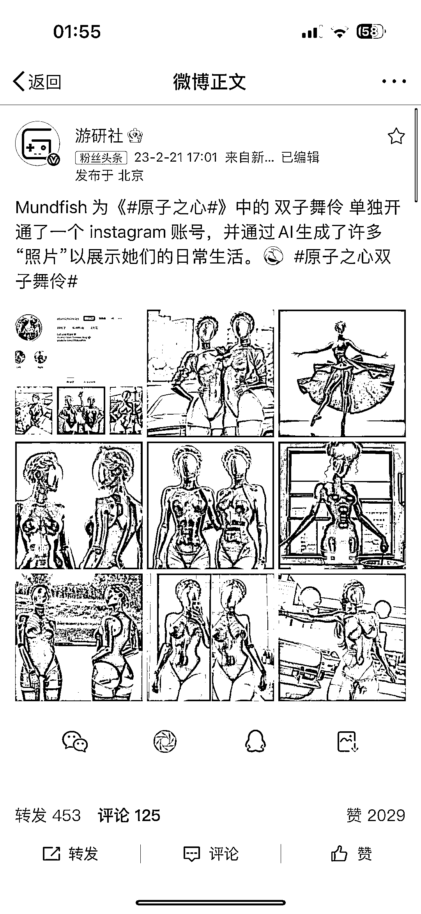
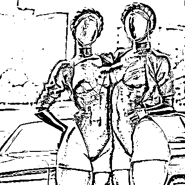
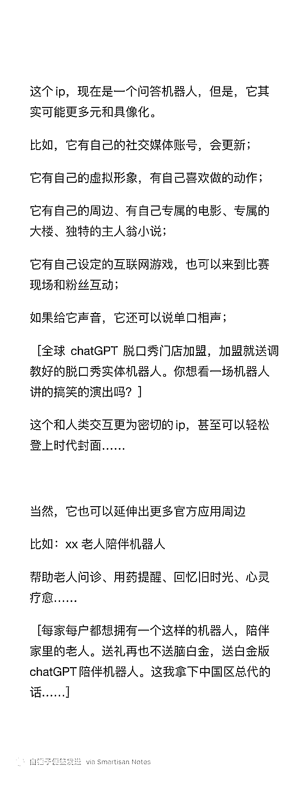

# 关于 chatGPT 的操作思考

> 原文：[`www.yuque.com/for_lazy/xkrm14/bxx81luek7123gvo`](https://www.yuque.com/for_lazy/xkrm14/bxx81luek7123gvo)

作者： 黄小刀🔪

日期：2023-02-23

点赞数：22

正文：

如果我是微软，我还会让 chatGPT 做什么？

  

  

  

评论区：

奶爸超人 : 能结合数字人就完美了

黄小刀🔪 : 那就真的是元宇宙，它的成长速度，让它构建一个自己的世界，指日可待

