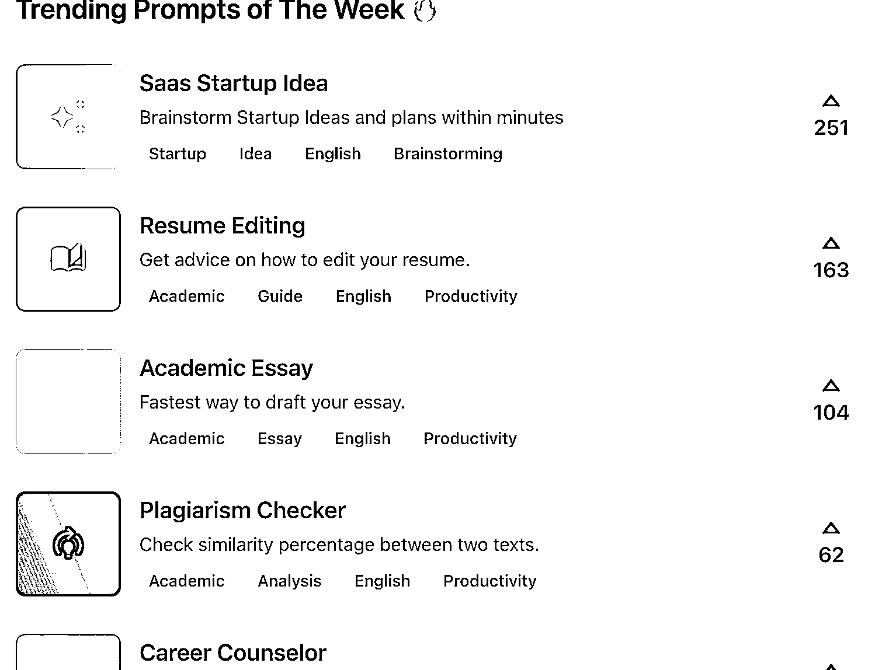
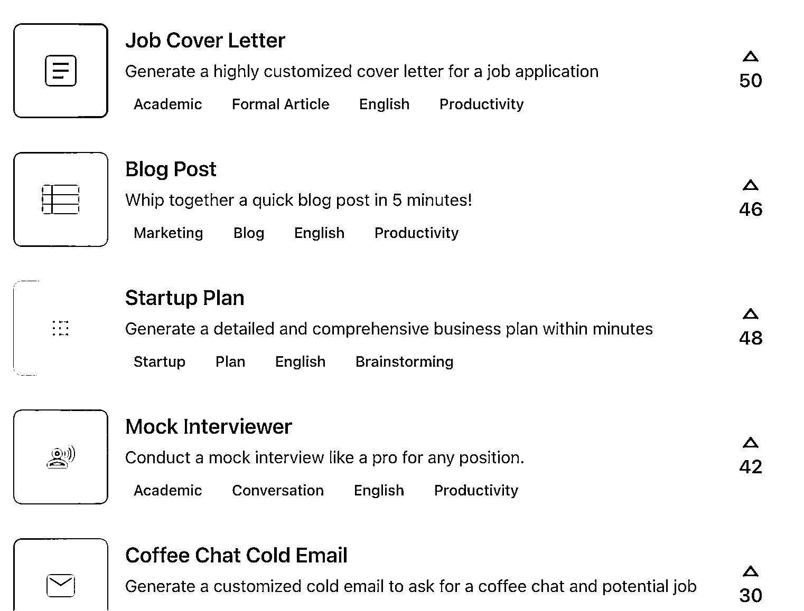
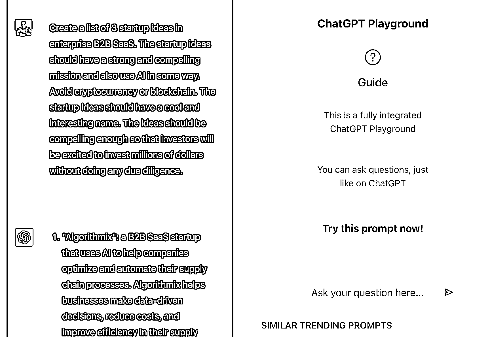

# flowgpt， chatgpt prompt 社群网站

> 原文：[`www.yuque.com/for_lazy/xkrm14/wos9ullcwxnb347o`](https://www.yuque.com/for_lazy/xkrm14/wos9ullcwxnb347o)

作者： 鱼

日期：2023-02-20

点赞数：40

正文：

flowgpt.com --- chatgpt prompt 社群网站，特点是按照不同场景将 prompt 分类，实用性比较强。包括如何写简历、如何写论文、如何写博客等。可以获得灵感看 chatgpt 能够应用在哪些场景，或者直接使用 prompt。因为是一个社群，还可以看到大家对每个 prompt 的喜好程度，目前最受欢迎的是让 gpt 生成一个用 AI 做 Saas 的创业灵感，chatgpt 能够快速帮你生成创业项目名称、介绍和产品功能。

  

  

  

  

  

评论区：

公众号懒人找资源，懒人专属群分享

