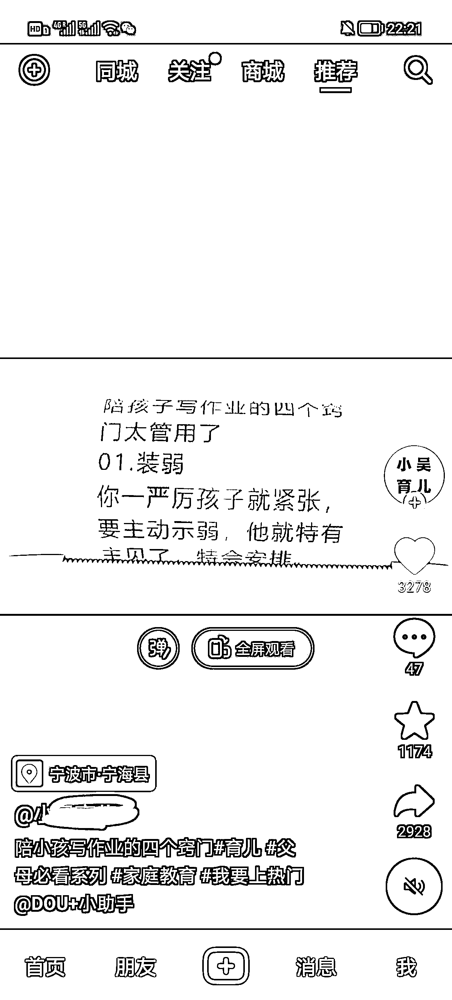

# 打印机生成短视频的新形式

> 原文：[`www.yuque.com/for_lazy/xkrm14/mv1ygrgmhekheruo`](https://www.yuque.com/for_lazy/xkrm14/mv1ygrgmhekheruo)

作者： 米笠

日期：2023-02-22

点赞数：30

正文：

打印机生成短视频的新形式 通过打印机，输入设定好的文案 拍摄打印文案的全过程。 这种短视频一是原创，二是不断打印文案的过程能够吸引观众的注意。 适合所有文案类账号，例如母婴育儿，学科，小说推文等。

  

评论区：

姬小光 : 类比一下，还可以用电子屏，手机短信，路边报纸，广告牌，任何能出字的地方，体验都会不一样

书伟说 : 哪里有方法论呀

