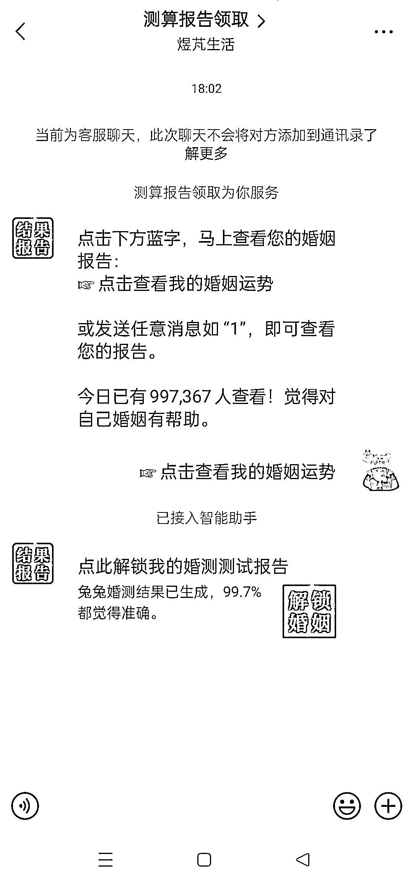

# 快手广告投放：婚姻测试，跳转微信，付费查看测试结果

> 原文：[`www.yuque.com/for_lazy/xkrm14/tcym1de55h2w0965`](https://www.yuque.com/for_lazy/xkrm14/tcym1de55h2w0965)

作者： 奇点

日期：2023-02-24

点赞数：47

正文：

快手广告投放：婚姻测试。填写姓名、性别、出生日期，点击「立即测试」，会直接跳转到企业微信智能助手（临时聊天，未添加好友），直接生成婚测测试报告链接，点击链接支付即可解散报告内容。 异常值：视频点赞 40w+，快手直接跳转微信对话技术，900w 人付费查看结果（可能是网页虚值）。

评论区：

lydia : 绝了，这个人我在抖音上也见过

千维 : 快手经常见过这个广告

潮州痞子蔡 : 那个 900 多万的查看数据大概率是假的，其实了解 2020 年疫情刚来的时候，字节刚推出的命理类小程序，再看看今天的快手这类业务，大家可以想到什么？

封伟-自动化变现 : 可以优化的地方 1.转化方式，除了广告投放还有小铃铛，快手卡片，自动回复，快手群 2.转化路径，除了跳转微信客服，还可以直接跳微信关注公众号或转个微企微等 微信客服的转化，步骤太长，可以压缩到一步跳转

奇点 : 厉害[强]

