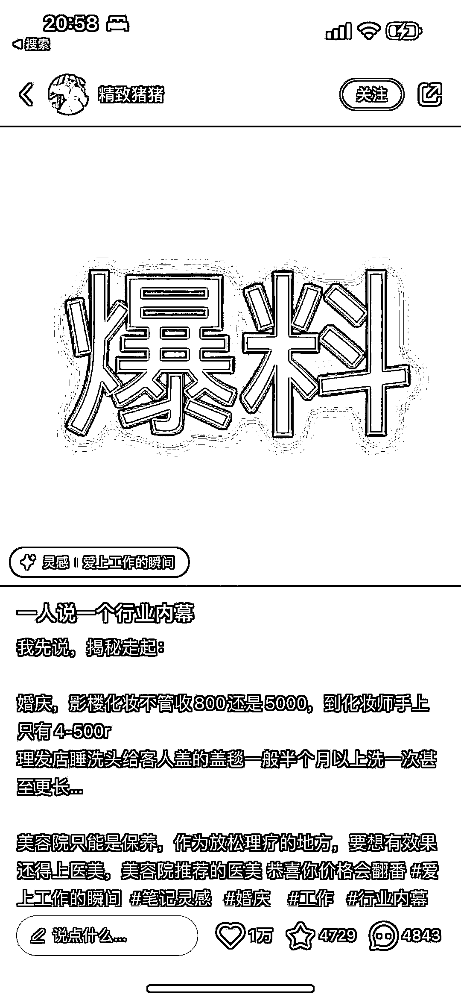
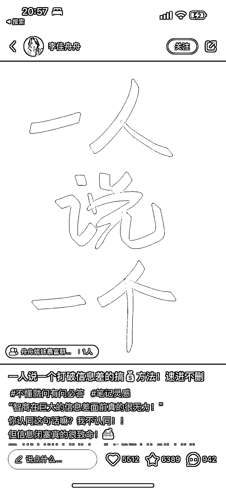
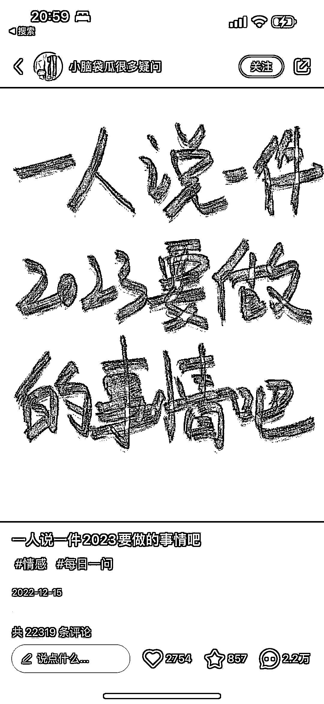
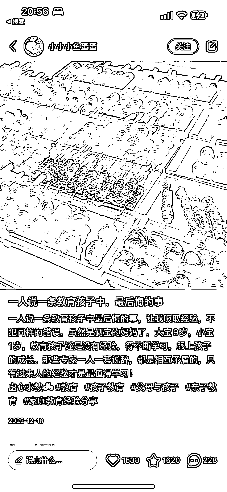
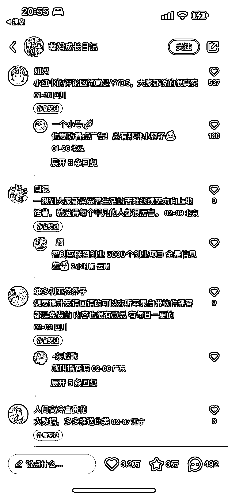

# 小红书一人说一个系列文案，互动数据好

> 原文：[`www.yuque.com/for_lazy/xkrm14/xagpbysk7yc0wy1a`](https://www.yuque.com/for_lazy/xkrm14/xagpbysk7yc0wy1a)

作者： 三米

日期：2023-02-23

点赞数：42

正文：

小红书主题：一人说一个系列 一人说一个行业内幕 一人说一个 30 岁建议 一人说一个 这类不一定会爆。但是模仿得对，大概率能爆。 因为“好为人师”和人类的表达欲望。 促使看到这样的标题就会不由自主的互动。 一互动，这数据就推起来了……

评论区：

公众号懒人找资源，懒人专属群分享

