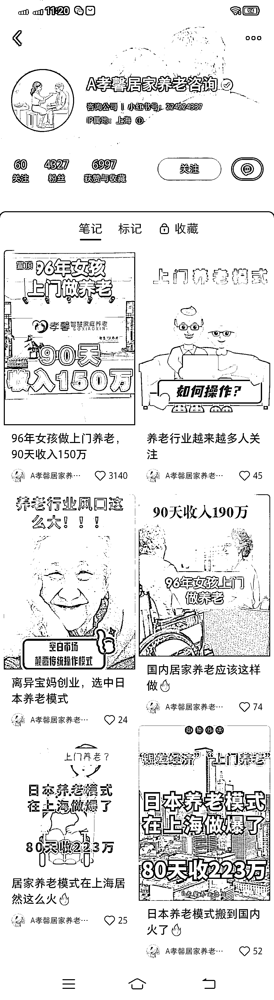

# 利用小红书引流，做上门养老服务

> 原文：[`www.yuque.com/for_lazy/xkrm14/degg9edfzz4258mc`](https://www.yuque.com/for_lazy/xkrm14/degg9edfzz4258mc)

作者： 小玫瑰

日期：2023-02-23

点赞数：33

正文：

96 年女孩上门做养老 90 天收入 150 万 模式:把日本的上门养老服务流程和细节搬到国内 政策趋势:我国做出 9073 规划，90%的老人居家养老，7%的社区养老，3%到养老院养老。 操作步骤: 1 注册一家养老服务有限公司 2.把日本的上门养老服务搬到国内 3.找到护理员 4.培训护理员 5.找客户，到小区发展社区代言人 6.护理员上门做免费试用。 能够看到这家公司在小红书的账号矩阵，评论区里引导给用户发资料，后期培训想要进入养老行业的人

  

评论区：

某人周 : 这种养老服务公司，需不需要什么资质呢？

公众号懒人找资源，懒人专属群分享

