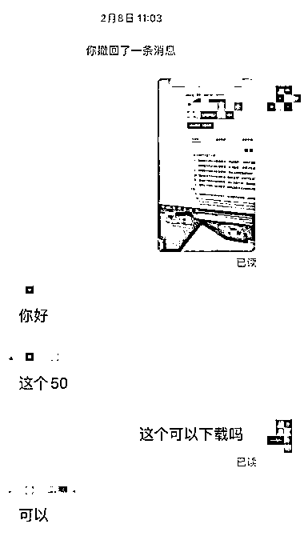
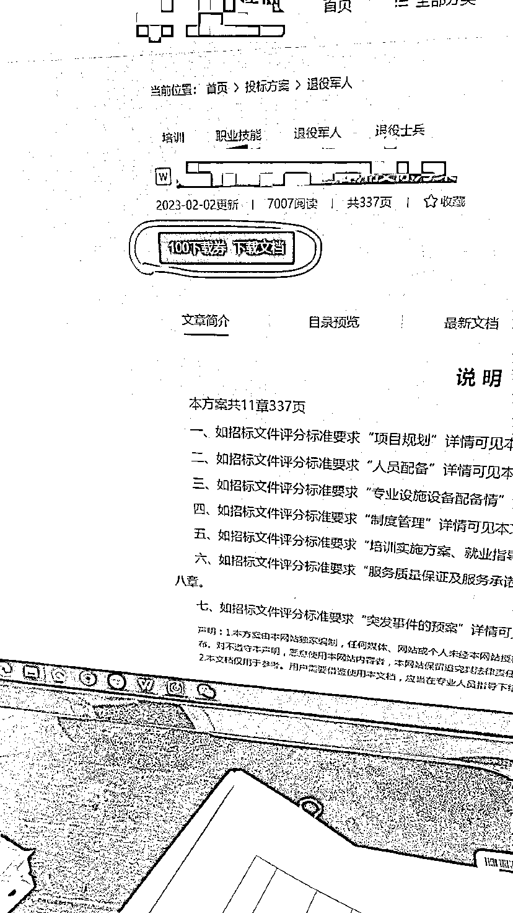
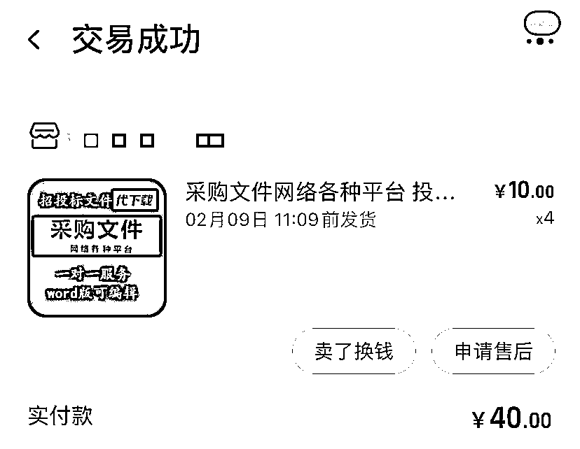
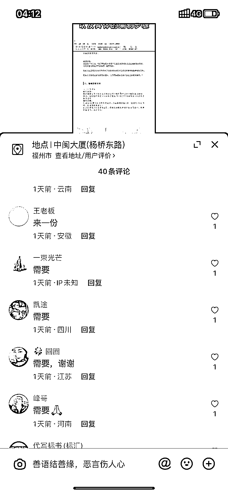

# 政府采购投标文件模板，虚拟商品操作思路

> 原文：[`www.yuque.com/for_lazy/xkrm14/lbrd2gafetixi6fe`](https://www.yuque.com/for_lazy/xkrm14/lbrd2gafetixi6fe)

作者： 时光

日期：2023-02-23

点赞数：29

正文：

虚拟品类，且客单价较高，更好转化，购买的都是企业老板之类的，政府采购投标文件模板。第一种，去网上找精美的投标文件模板做成图文或者视频，想办法引流到私域成交转化。 引流到私域购买模板后还可以延伸出帮制作投标文件。中间赚差价就行，接到的单淘宝询价给淘宝做。还可以帮下载网站里面的文件，他发给你，你发给淘宝询价就行，再加价卖。一个很好的品类。

  

  

  

  

  

  

评论区：

