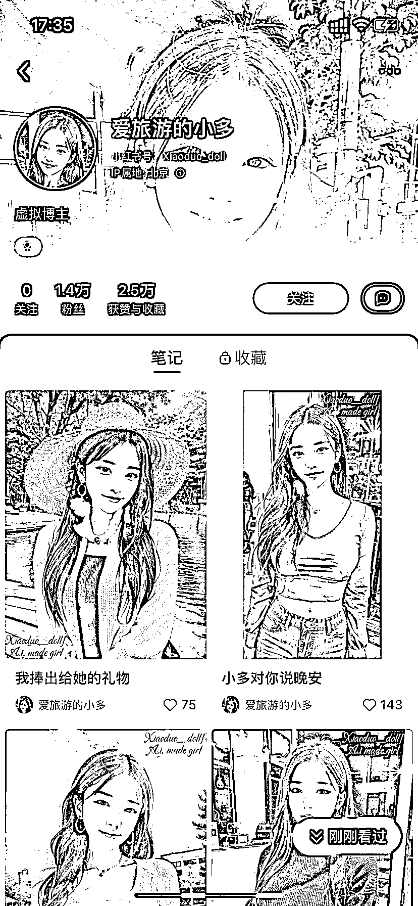

# 小红书，AI 绘画生成真人图片做 IP 数据很好

> 原文：[`www.yuque.com/for_lazy/xkrm14/myb7ri71yus1unl3`](https://www.yuque.com/for_lazy/xkrm14/myb7ri71yus1unl3)

作者： 太波

日期：2023-02-22

点赞数：30

正文：

虚拟人进去个人 ip 领域，可能是未来的一个新兴的产业，随着 ai 算法的进步，现有的 ai 的缺点会逐步被解决，那个时候我们无法分辨一个人是真人还是 ai，下图的博主就是 ai 生成的，而且这种虚拟博主可以批量制作。这是一个巨大的机会。

  

评论区：

繁星 : 怎么变现？卖号吗

太波 : 变现和现在小红书的个人 ip 变现没区别，一样的

