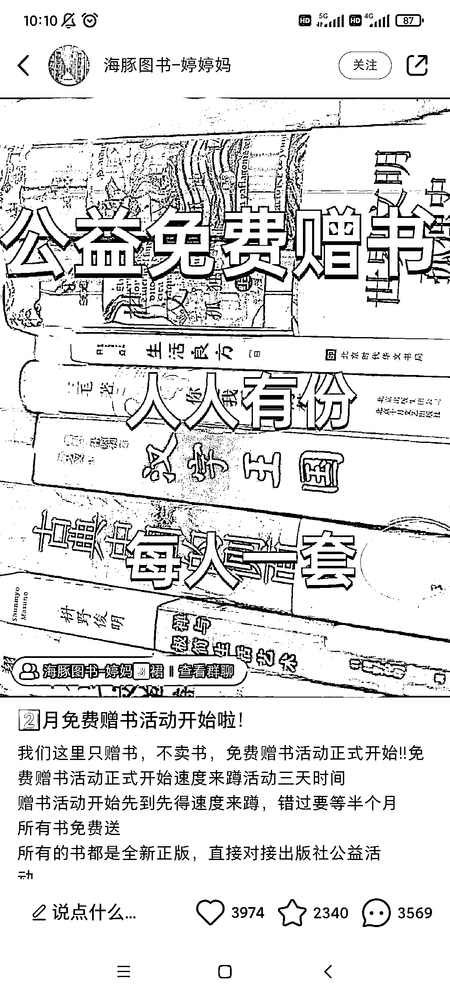
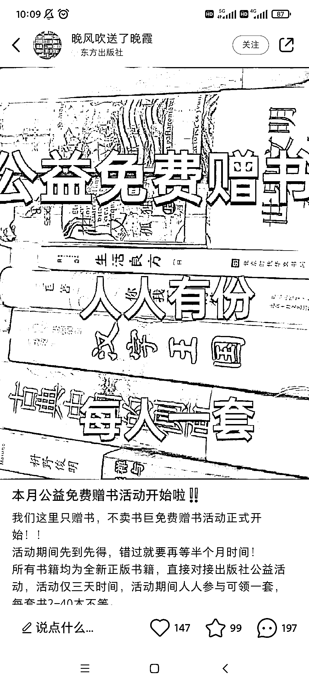
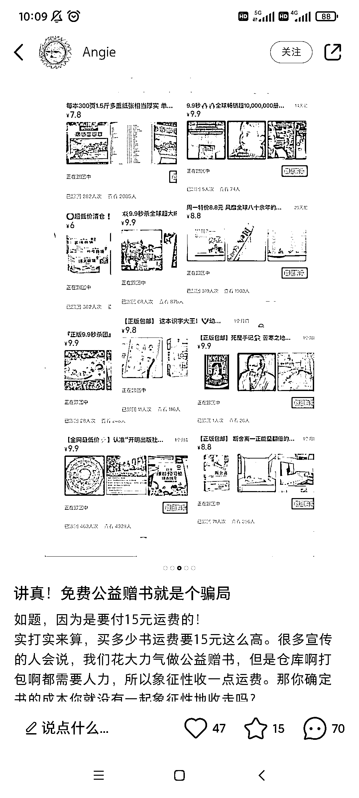

# 小红书公益赠书玩法分析

> 原文：[`www.yuque.com/for_lazy/xkrm14/itgor6nsh4ko92hq`](https://www.yuque.com/for_lazy/xkrm14/itgor6nsh4ko92hq)

作者： 阿黎

日期：2023-02-21

点赞数：16

正文：

小红书上频繁刷到 公益赠书 ，付费 15 元，送你一套书，开盲盒。(我觉得，对应的，再往上的玩法，就是 keep 跑步买奖章了) 公益赠书，引流的大多都是新号，而且不光同个账号就是重复怼一样的笔记(图都一样那种，居然没触发风控，看来只要有自然互动就会推流)，而且不同账号都用同一个图! 初步看了一下，有好多账号说公益赠书的反馈，大概有两种玩法 一种是粉丝收到的书，不值 15 元，从书里赚差价 一种是差不多值 15 元，不在书上赚钱，靠 0 元引流加社群，做二次变现 主要是，这个玩法简单粗暴，而且依然有很大的量，算是资料引流的一种升级，把书换成其他对应目标人群喜欢的东西，加上公益、盲盒的元素，闭环也是成立的

评论区：

