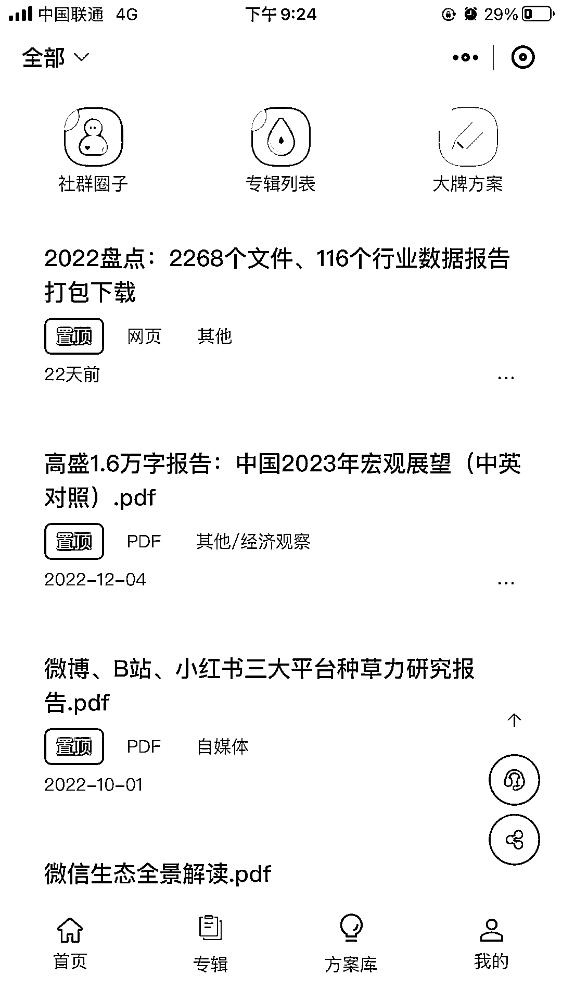
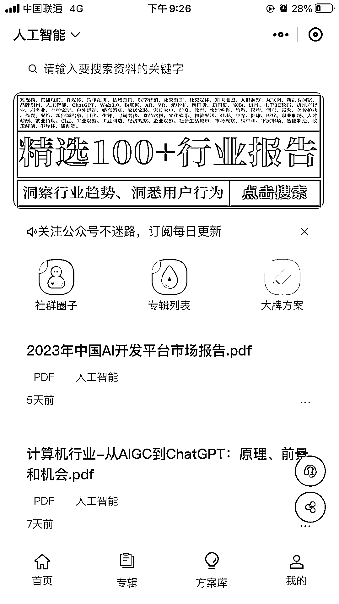

# 垂直的行业学报，公众号引流，小程序充值付费下载

> 原文：[`www.yuque.com/for_lazy/xkrm14/eb9px7ei5rwo44yh`](https://www.yuque.com/for_lazy/xkrm14/eb9px7ei5rwo44yh)

作者： 海绵践行

日期：2023-02-21

点赞数：18

正文：

顺着圈友发的小红书月报风向标搜索，发现了一个垂直的行业学报公众号+小程序 公众号引流，小程序充值付费下载 点进去看到了不少行业（包括小红书的） 1 份报告 2～3 元 微信搜一搜很靠前，预计收入应该挺好的（不太懂）

评论区：

深蓝 blue : 叫啥呀

海绵践行 : 小程序叫：报告通查

