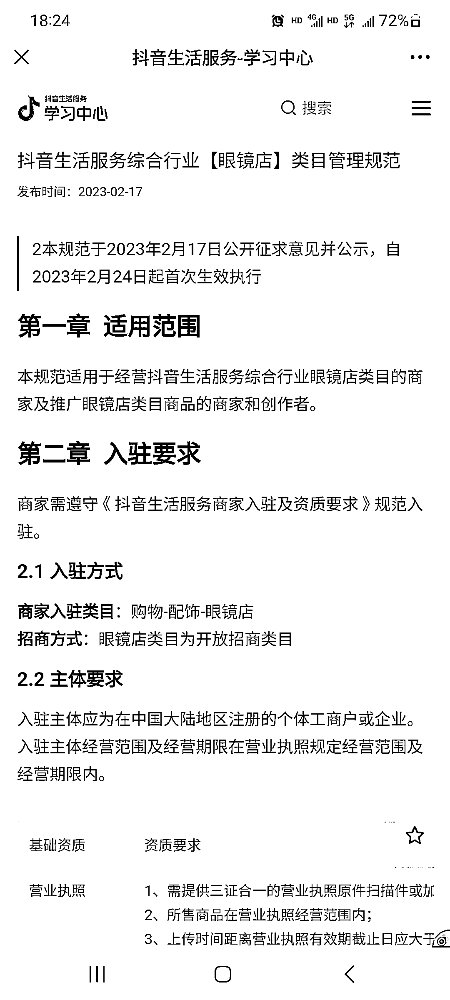

# 抖音本地生活眼镜店类目，开放申请，竞争激烈

> 原文：[`www.yuque.com/for_lazy/xkrm14/gqziunw5wfnnxwd0`](https://www.yuque.com/for_lazy/xkrm14/gqziunw5wfnnxwd0)

作者： 楚川

日期：2023-02-17

点赞数：40

正文：

抖音本地生活 2023 年卷到爆炸的第一个类目来了，就是眼镜店。 不过我从 21 年做了以后，就没接着推荐这个行业，虽然我知道毛利高，但是架不住核销率低。这期间也持续有品牌找我们做，都被我拦在门外，因为费力不讨好。 现在几个品牌在抖音就能跑出 1 亿的 GMV，非常非常非常风光。但是 10%的核销率，让 ROI 到十分之一，就没想到吧。 不过字节才不会管，他只需要单位时间的 GMV 足够高，有足够多的内容，有足够多的投放。这就是平台想要的，品牌方你就自己看着办，赚了赔了跟他们没有关系。一个行业的兴起，必将伴随 90%的韭菜。 2 月 24 全行业放开，基本上堵死报白行业的一个赚钱口子。接下来就是疯狂的流量对冲，gmv 闭着眼睛打到 10，最后会到 3 以内，终局就是一起嗝屁。 你觉得下一个疯狂的类目是什么呢？gmv 高，毛利高，核销率低，投放舍得花钱的行业。

评论区：

东风伍六一 : 如果品牌找你，可以找我对接

九九 : 难怪抖音全给我推眼镜广告

