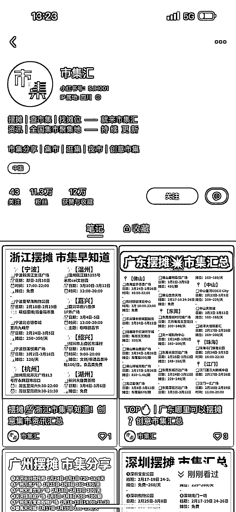

# 小红书发布市集信息汇总，组织摆摊

> 原文：[`www.yuque.com/for_lazy/xkrm14/usvw2h8srr1o7ssw`](https://www.yuque.com/for_lazy/xkrm14/usvw2h8srr1o7ssw)

作者： 三米

日期：2023-02-17

点赞数：22

正文：

摆地摊 地摊信息组织。摆摊收租位费。 小红书这个账号引流不错。 对接商场广场那个物业公司，谈下来一块地。 然后组织摆地摊的人。 甚至双向收费。 一来收取商场物业的活跃引流活动策划费 一来收取个人的摊位租金费。

  

  

  

评论区：

