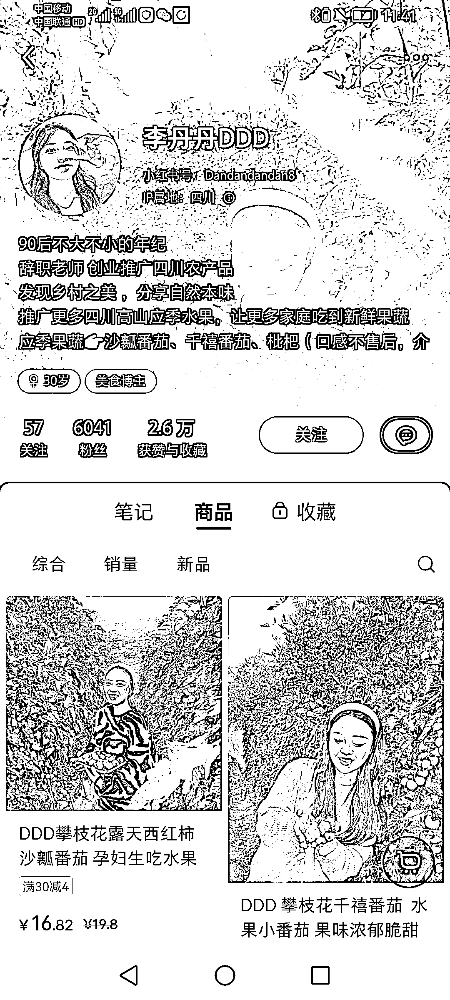

# 小红书推广原产地水果

> 原文：[`www.yuque.com/for_lazy/xkrm14/ykv2cdwg0dfu1e1o`](https://www.yuque.com/for_lazy/xkrm14/ykv2cdwg0dfu1e1o)

作者： 留住昨天

日期：2023-02-16

点赞数：18

正文：

有水果资源的也可以挂小红书试试。坚持一下去就会有收获。

  

  

评论区：

肖翔 : 两万单 这个成绩很牛啊

留住昨天 : 是呀。有水果资源的可以挂一下试试。无脑上视频就好啦[呲牙]

洞主 : 可否留个 V 交流一下

留住昨天 : 这个是我看到的，不是我的项目😂，我就发个风向标

