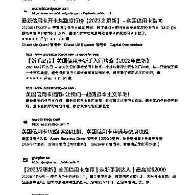
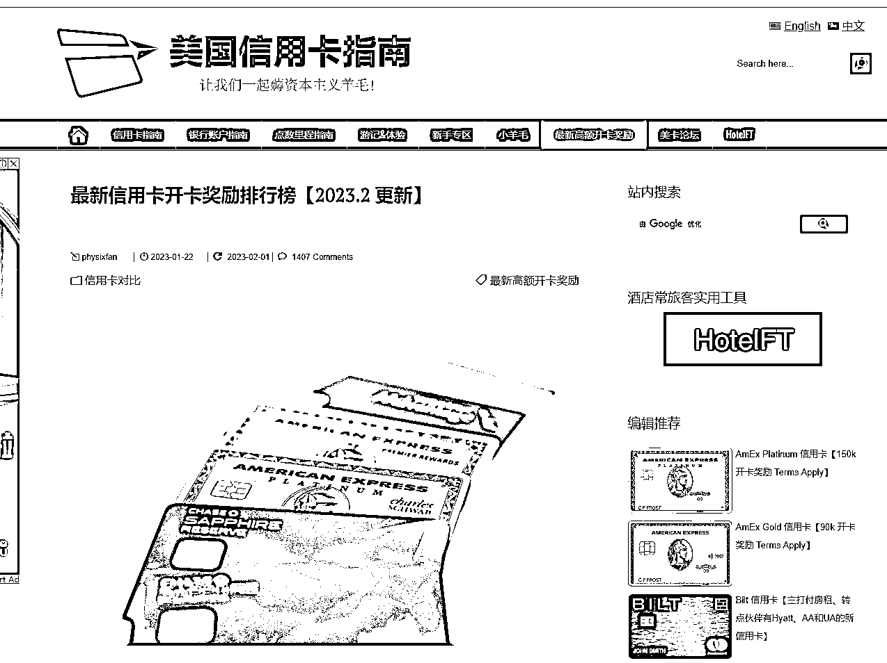

# 海外华人信息差之信用卡推荐网站

> 原文：[`www.yuque.com/for_lazy/xkrm14/bk66mtqg7ww7c8el`](https://www.yuque.com/for_lazy/xkrm14/bk66mtqg7ww7c8el)

作者： 米笠

日期：2023-02-15

点赞数：14

正文：

海外华人信息差之信用卡推荐网站 美国的信用卡种类非常多 各个卡的功能和返利都不一样 美国华人，尤其是美国留学生经常会从网上搜索如何办理信用卡，办理哪种信用卡。 这种信用卡推荐网站，就是把某张卡的优点和用法全部写出来 通过推荐办卡获得佣金 一般办理一张卡，推荐人和被推荐人都能获得 100-600 刀/人 还有推荐电话卡内容，推荐佣金 10-20 刀/人。

  

  

评论区：

xing : 友人带的老师，非常棒的视角！

