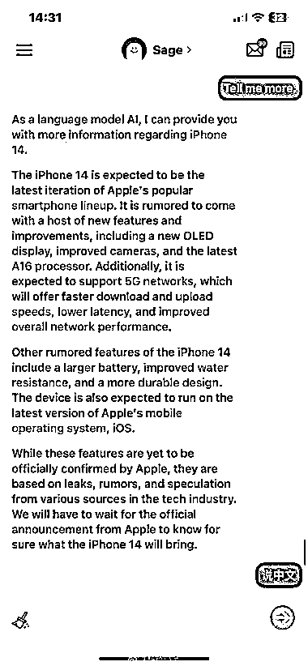
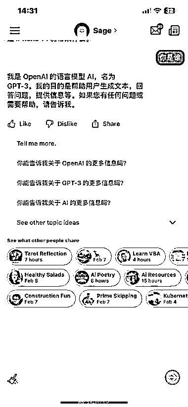
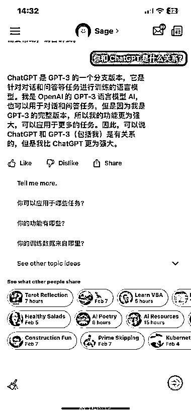

# 工具推荐：无法 ChatGPT 的可以试下 Poe App

> 原文：[`www.yuque.com/for_lazy/xkrm14/atdiu1q2outczwil`](https://www.yuque.com/for_lazy/xkrm14/atdiu1q2outczwil)

作者： 精神老伙

日期：2023-02-08

点赞数：36

想体验 ChatGPT ，又不知道怎么注册的朋友，可以下载这个 Poe App 试试。 这款应用调用的就是 OpenAI 公司的 ChatGPT API，由国外问答 SNS 网站 Quora 公司开发，就是那个国外的「知乎」。是正规软件，目前只有 iOS 版，iPhone、iPad、Mac 都能下载体验，而且里面没有广告，目前也完全免费。 关键是用国内手机号就能注册使用，不像 ChatGPT 必须要国外手机号才行，很多人就是被这一步卡住了。不过它也需要魔法上网，你懂得。 对了，如果你收到的是英文回复，那你只需要再回复它「说中文」三个字，就可以切换为中文对答，用起来非常方便。

  

  

  

  

  

  

公众号懒人找资源，懒人专属群分享作者： 精神老伙

日期：2023-02-08

点赞数：36

想体验 ChatGPT ，又不知道怎么注册的朋友，可以下载这个 Poe App 试试。 这款应用调用的就是 OpenAI 公司的 ChatGPT API，由国外问答 SNS 网站 Quora 公司开发，就是那个国外的「知乎」。是正规软件，目前只有 iOS 版，iPhone、iPad、Mac 都能下载体验，而且里面没有广告，目前也完全免费。 关键是用国内手机号就能注册使用，不像 ChatGPT 必须要国外手机号才行，很多人就是被这一步卡住了。不过它也需要魔法上网，你懂得。 对了，如果你收到的是英文回复，那你只需要再回复它「说中文」三个字，就可以切换为中文对答，用起来非常方便。

  

  

  

  

  

  

公众号懒人找资源，懒人专属群分享

