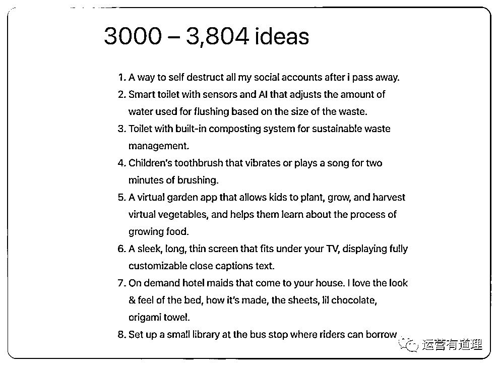
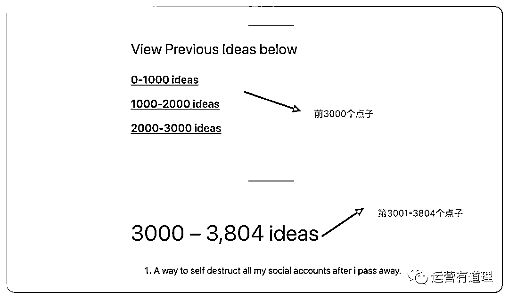

# 网站推荐：包含 3000+非常不错的创意点子

> 原文：[`www.yuque.com/for_lazy/xkrm14/bx1vf23ipz9hwy99`](https://www.yuque.com/for_lazy/xkrm14/bx1vf23ipz9hwy99)

作者： 精准侠

日期：2023-02-06

点赞数：15

老外整理出来的网站，包含了 3000+非常不错的创意点子 1）小孩刷牙时，牙刷能自动播放 2 分钟歌曲。 2）USB 加热露指手套，适合寒冷的早晨在电脑前使用。 3）一个 ins 工具，能根据 post 内容，自动生成 captions 和 hashtags；让 post 更吸引人和更容易被找到。 4）能有一个 AI 工具，自动把自己或别人的博客转化成简短的 Twitter 帖子。 5）能有一个 Whatsapp 工具，能把音频转化成不同国家的文字语言。（实时把自己或对方聊天文字转换成不同文字语言的工具目前是有的，有兴趣的可以问我） 6）一种可以根据风力大小自动调节松紧度的帽子。 7）制作一种可冲洗的婴儿湿巾。 8）带有打地鼠式冲水器的儿童马桶。 9）卫生纸卷内的纸板应由可冲走的材料制成。 10）牛奶变质后会变色的牛奶盒。 这样的创意，这个网站有 3000 多条，这个网站的网址是： 这些点子并不是天马行空，很多还是有很强的可执行性。如果你正在寻找产品灵感（实体产品和软件产品都算），不妨看看这个网站，一定会有启发。[Ideasgrab+-+list+of+ideas+for+you+to+grab.](https://www.ideasgrab.com/)

  

  

