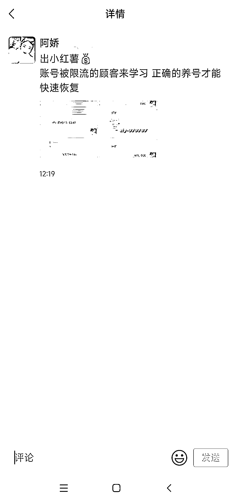

# 小红书被投诉，防坑指南

> 原文：[`www.yuque.com/for_lazy/xkrm14/tl0ryl5n4uo1iexb`](https://www.yuque.com/for_lazy/xkrm14/tl0ryl5n4uo1iexb)

作者： 阿黎

日期：2023-02-09

点赞数：7

防坑风向标，账号解封风向标 有一阵，小红书账号老是被人举报，被封， 哪怕是刚发了两篇笔记，刚起号来量的新账号，就被人举报，觉得很莫名。 然后直到，有人带着“帮你解封”的钩子来加我微信 这些人，批量去举报别人的账号，然后说自己有办法帮你解封，帮你提高权重，如何如何，然后你号起来后，再去举报你，简直是! 举报是她，所谓帮你解封也是她(其实不是，还是要靠你自己贡献内容，提高权重)! 大家别上当，老实看生财的航海手册操作。 没参加航海的赶紧参加，航海后也一直有教练在群里答疑。

  

  

公众号懒人找资源，懒人专属群分享

