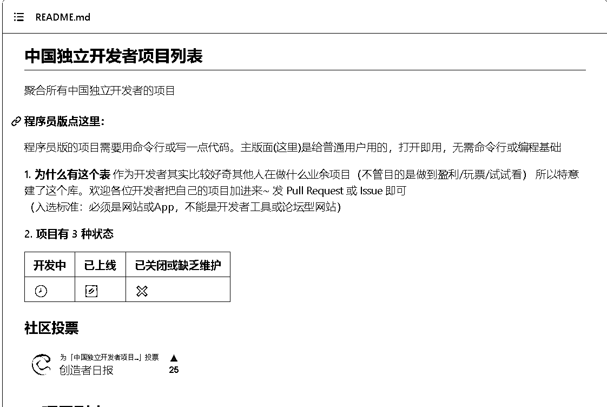
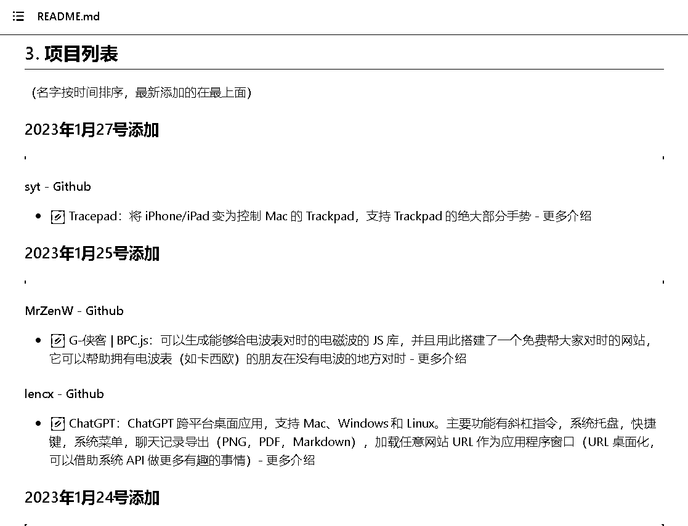

# github 上 18.7k Star 的项目——中国独立开发者项目列表

> 原文：[`www.yuque.com/for_lazy/xkrm14/hg1akwavticghnag`](https://www.yuque.com/for_lazy/xkrm14/hg1akwavticghnag)

作者： LimBo

日期：2023-02-06

点赞数：10

github 上 18.7k Star 的项目——中国独立开发者项目列表，汇集国内众多独立开发者的创业项目，是找创业灵感思路的好地方。 链接： [GitHub+-+1c7/chinese-independent-developer:+👩🏿‍💻👨🏾...](https://github.com/1c7/chinese-independent-developer)

公众号懒人找资源，懒人专属群分享作者： LimBo

日期：2023-02-06

点赞数：10

github 上 18.7k Star 的项目——中国独立开发者项目列表，汇集国内众多独立开发者的创业项目，是找创业灵感思路的好地方。 链接： [GitHub+-+1c7/chinese-independent-developer:+👩🏿‍💻👨🏾...](https://github.com/1c7/chinese-independent-developer)

公众号懒人找资源，懒人专属群分享

