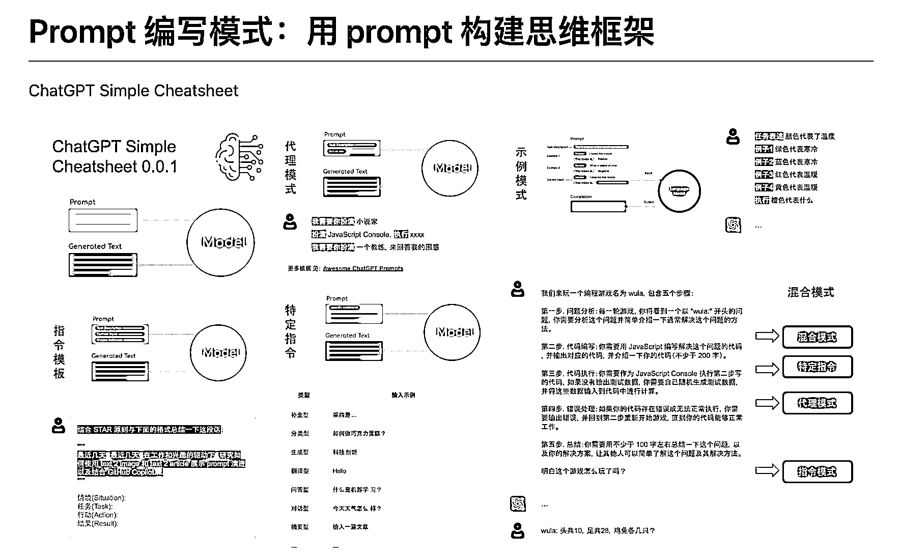

# 基于 ChatGPT、GitHub Copilot、Stable Diffusion 使用的 prompt 的总结

> 原文：[`www.yuque.com/for_lazy/xkrm14/mwg6lrs9b0o1l7we`](https://www.yuque.com/for_lazy/xkrm14/mwg6lrs9b0o1l7we)

作者： 果林

日期：2023-02-24

点赞数：27

<ne-hole id="u9df17ad0" data-lake-id="u9df17ad0"><ne-card data-card-name="hr" data-card-type="block" id="gTfxs" data-event-boundary="card">

正文：

如何将思维框架赋予机器，以设计模式的形式来思考 prompt。 —— 基于 ChatGPT、GitHub Copilot、Stable Diffusion 使用的 prompt 的总结。（来自推友 ShīnChvën） 地址： 值得一读！[GitHub+-+phodal/prompt- patterns:+Prompt+编写模式：如何将思维...](https://github.com/phodal/prompt-patterns)

<ne-card data-card-name="image" data-card-type="inline" id="wcskx" data-event-boundary="card">  <ne-hole id="uc23f485e" data-lake-id="uc23f485e"><ne-card data-card-name="hr" data-card-type="block" id="QTj62" data-event-boundary="card"><ne-p id="ufd837c80" data-lake-id="ufd837c80">评论区：

<ne-hole id="u50559359" data-lake-id="u50559359"><ne-card data-card-name="hr" data-card-type="block" id="DKmWH" data-event-boundary="card">

公众号懒人找资源，懒人专属群分享

</ne-card></ne-hole></ne-card></ne-hole></ne-card></ne-p></ne-card></ne-hole>