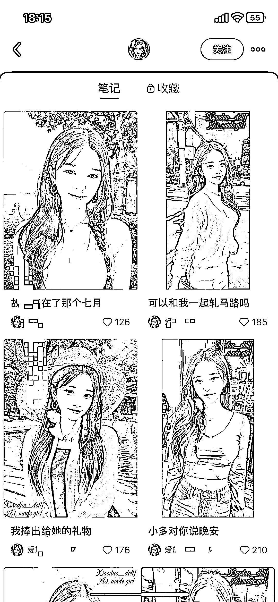

# 使用 stablediffusion 做的 ai 真人，小红书点赞收藏爆棚

> 原文：[`www.yuque.com/for_lazy/xkrm14/qlq2ahensp8impg8`](https://www.yuque.com/for_lazy/xkrm14/qlq2ahensp8impg8)

作者： 徐同学

日期：2023-02-23

点赞数：78

<ne-hole id="u3cc422ba" data-lake-id="u3cc422ba"><ne-card data-card-name="hr" data-card-type="block" id="lQbFd" data-event-boundary="card">

正文：

使用 stablediffusion 做的 ai 真人，小红书点赞收藏爆棚

<ne-card data-card-name="image" data-card-type="inline" id="JTbMv" data-event-boundary="card">  <ne-hole id="u3e86e586" data-lake-id="u3e86e586"><ne-card data-card-name="hr" data-card-type="block" id="FpAbI" data-event-boundary="card"><ne-p id="uffc2e5e7" data-lake-id="uffc2e5e7">评论区：

犹豫的潜行者 : AI 绘图，chatgpt 生成文案。一天的可以生产好多条。

徐同学 : 是的

孙骄 Zzzz : 哈哈哈哈，我刚发了一个，就看到圈友发了，圈友的敏感度好高

徐同学 : [捂脸]

马荣誉 : 马赛克打得猜都能猜到什么名字

反方向的钟 : 这是 AI 呀，竟没看出来

白奇杉 : 太厉害了

姬小光 : 重点是吸引了色粉你拿什么交付[偷笑]

<ne-hole id="ucacee469" data-lake-id="ucacee469"><ne-card data-card-name="hr" data-card-type="block" id="mYdj9" data-event-boundary="card">

公众号懒人找资源，懒人专属群分享

</ne-card></ne-hole></ne-card></ne-hole></ne-card></ne-p></ne-card></ne-hole>