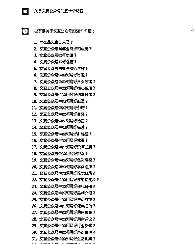

# Chatgpt 咨询领域相关问题，直播解答过程引流做知识付费

> 原文：[`www.yuque.com/for_lazy/xkrm14/wcbfqoeuhlzx1prh`](https://www.yuque.com/for_lazy/xkrm14/wcbfqoeuhlzx1prh)

<ne-p id="ubfb9669e" data-lake-id="ubfb9669e"><ne-text id="uf022b0c7">作者： 萤火虫</ne-text></ne-p> <ne-p id="uf1059ede" data-lake-id="uf1059ede"><ne-text id="u2fede678">日期：2023-02-23</ne-text></ne-p> <ne-p id="u5552d1d6" data-lake-id="u5552d1d6"><ne-text id="u20d6d0d1">点赞数：</ne-text><ne-text id="ubb58e110" ne-bold="true">57</ne-text></ne-p> <ne-hole id="u260a5888" data-lake-id="u260a5888"><ne-card data-card-name="hr" data-card-type="block" id="j4USh" data-event-boundary="card"><ne-p id="u8fe556b5" data-lake-id="u8fe556b5"><ne-text id="u83fb705a">正文：</ne-text></ne-p> <ne-p id="u3a836e5e" data-lake-id="u3a836e5e"><ne-text id="u39818209">问 Chatgpt 某些领域相关的问题，然后你可以去做知识付费 可以直播解答这些问题 甚至有了 Chatgpt 你任何知识付费都可以做</ne-text></ne-p> <ne-p id="uea6d0cdf" data-lake-id="uea6d0cdf"><ne-card data-card-name="image" data-card-type="inline" id="mLWuE" data-event-boundary="card">  <ne-p id="u009700f4" data-lake-id="u009700f4"><ne-card data-card-name="image" data-card-type="inline" id="uyVY2" data-event-boundary="card">  <ne-p id="u46d5549d" data-lake-id="u46d5549d"><ne-card data-card-name="image" data-card-type="inline" id="Ndp6i" data-event-boundary="card">  <ne-p id="uacc58252" data-lake-id="uacc58252"><ne-card data-card-name="image" data-card-type="inline" id="g2VWT" data-event-boundary="card">  <ne-p id="u31433ad7" data-lake-id="u31433ad7"><ne-card data-card-name="image" data-card-type="inline" id="Fuel0" data-event-boundary="card">  <ne-hole id="u5cbbb8b3" data-lake-id="u5cbbb8b3"><ne-card data-card-name="hr" data-card-type="block" id="dHLAH" data-event-boundary="card"><ne-p id="u463a1dd9" data-lake-id="u463a1dd9"><ne-text id="ud8c4f8ec">评论区：</ne-text></ne-p> <ne-p id="u98c9a2bb" data-lake-id="u98c9a2bb"><ne-text id="u4de82a77">花满楼 : 这个不错</ne-text></ne-p> <ne-p id="uce200119" data-lake-id="uce200119"><ne-text id="uc4045f04">萤火虫 : 是的</ne-text></ne-p> <ne-p id="u643e22d6" data-lake-id="u643e22d6"><ne-text id="ube6f56b4">顾强 : chatGPT 训练数据只到 21 年，除非你自己 training。不如很多信息是滞后的</ne-text></ne-p> <ne-p id="u2967db39" data-lake-id="u2967db39"><ne-text id="u0a35f3c1">萤火虫 : 辅助工具</ne-text></ne-p> <ne-p id="u61cf2036" data-lake-id="u61cf2036"><ne-text id="u213db83b">melisa : 没错</ne-text></ne-p> <ne-p id="u1133426e" data-lake-id="u1133426e"><ne-text id="ub1bc7f76">子凌 : 用魔法打败魔法，很靠谱</ne-text></ne-p> <ne-hole id="ueb60a3ce" data-lake-id="ueb60a3ce"><ne-card data-card-name="hr" data-card-type="block" id="DUWEa" data-event-boundary="card"><ne-p id="u75930253" data-lake-id="u75930253"><ne-text id="uc9ce19aa">公众号懒人找资源，懒人专属群分享</ne-text></ne-p></ne-card></ne-hole></ne-card></ne-hole></ne-card></ne-p></ne-card></ne-p></ne-card></ne-p></ne-card></ne-p></ne-card></ne-p></ne-card></ne-hole>