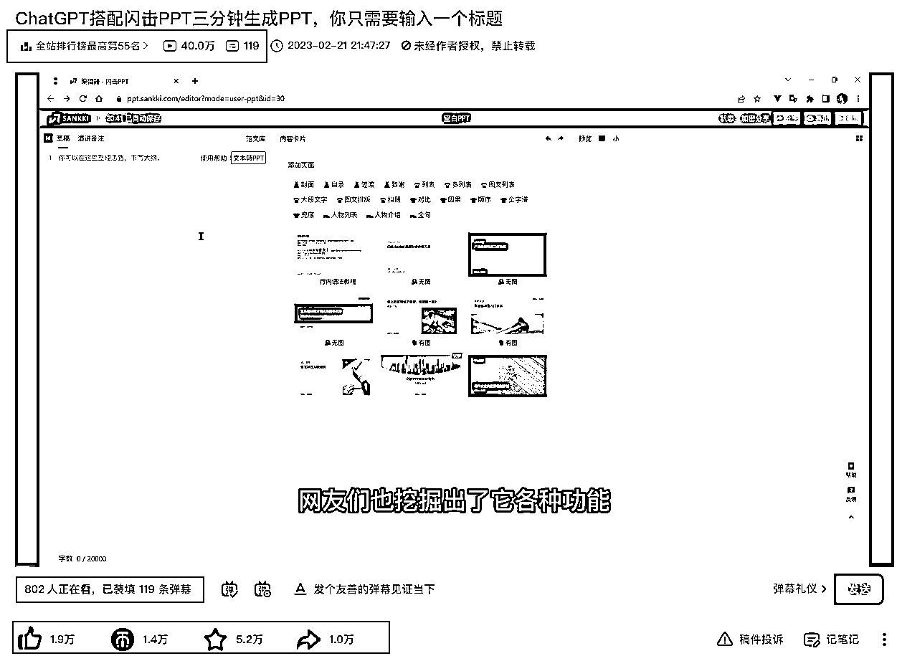

# 利用 ChatGPT 针对垂直赛道，输出简历模板

> 原文：[`www.yuque.com/for_lazy/xkrm14/vboeggwh2qomkeys`](https://www.yuque.com/for_lazy/xkrm14/vboeggwh2qomkeys)

<ne-p id="ub2e4627f" data-lake-id="ub2e4627f"><ne-text id="u53bef5b5">作者： 常常</ne-text></ne-p> <ne-p id="uead893b0" data-lake-id="uead893b0"><ne-text id="ue6c8eea1">日期：2023-02-23</ne-text></ne-p> <ne-p id="u2256b504" data-lake-id="u2256b504"><ne-text id="u5abad05c">点赞数：</ne-text><ne-text id="ue788ef66" ne-bold="true">27</ne-text></ne-p> <ne-hole id="u45ef0a25" data-lake-id="u45ef0a25"><ne-card data-card-name="hr" data-card-type="block" id="EFvLL" data-event-boundary="card"><ne-p id="uf35247c6" data-lake-id="uf35247c6"><ne-text id="ub173be43">正文：</ne-text></ne-p> <ne-p id="u33041a69" data-lake-id="u33041a69"><ne-text id="u4429a79b">昨天的分享帖子下面， 圈友 回复了一个 B 站的视频，这个视频发布后直接上了 B 站热榜今天更是排名冲到了全站最高 55， 40 万播放，同时在线观看人数 800 多人</ne-text> <ne-text id="uf4e110b4">没想到工具组合能够爆发出这么大的热点，工具组合提升办公效率大有可为</ne-text> <ne-text id="u591f3f4e">昨晚翻小蓝鸟，发现一个程序员的简历网站，里面的简历也可以用 ChatGPT 直接生成,如果把这个搞成自动化，做针对程序员的垂直应用，也是一个很好的模式</ne-text> <ne-text id="u70d28b85">经验分享： （1）用 ChatGPT 测试一周，做了 5 份简历，做通用型的工作流程，很麻烦，涉及到的工作岗位多，ChatGPT 的提示词需要改变的多；</ne-text> <ne-text id="u2560489f">（2）针对一个垂直赛道，输出简历模板，能够提供更好的服务； （3）初级服务满足后，看用户评论，如果保持简历模板的更新，用户更愿意付费。</ne-text> <ne-text id="u8671b724">这条信息可以帮助圈友的是： （1）制作同类主题 AI 工具流，提升办公效率； （2）同款视频，其他平台引流，变现；</ne-text> <ne-text id="ue05af777">（3）深扎垂直赛道，找准一个方向，打造一个工作流程。</ne-text> [<ne-text id="u41224457">https://t.zsxq.com/0bJxAZ5u7</ne-text>](https://t.zsxq.com/0bJxAZ5u7)</ne-p> <ne-p id="uc9bbc261" data-lake-id="uc9bbc261"><ne-card data-card-name="image" data-card-type="inline" id="SIMTA" data-event-boundary="card">  <ne-hole id="u92e858bb" data-lake-id="u92e858bb"><ne-card data-card-name="hr" data-card-type="block" id="pMrZg" data-event-boundary="card"><ne-p id="u8710967d" data-lake-id="u8710967d"><ne-text id="ud0d80000">评论区：</ne-text></ne-p> <ne-p id="ue46c250f" data-lake-id="ue46c250f"><ne-text id="udd495032">TED : 我按照 B 站这个视频里做 ppt 的流程走了一遍，然后做了个教程，抖音和小红书播放都很不错</ne-text></ne-p> <ne-p id="u3ac4a9d7" data-lake-id="u3ac4a9d7"><ne-text id="ub168707d">常常 : 对，你这执行力真强！</ne-text></ne-p> <ne-p id="uf1a8a015" data-lake-id="uf1a8a015"><ne-text id="uf6c7dccd">TED : 想到一块去了，围绕办公自动化，或者单纯提高效率这一块，专注做好这个就有挺多机会的</ne-text></ne-p> <ne-p id="u1ab3c033" data-lake-id="u1ab3c033"><ne-text id="u54a3b6e6">常常 : 我加你微信，我们一起交流下啊[强]</ne-text></ne-p> <ne-p id="ua7301e6a" data-lake-id="ua7301e6a"><ne-text id="u3a4574c9">TED : 好 私你了</ne-text></ne-p> <ne-p id="u62ae2afb" data-lake-id="u62ae2afb"><ne-text id="uffff3bc6">徐同学 : 一起呀</ne-text></ne-p> <ne-hole id="u9a127b3c" data-lake-id="u9a127b3c"><ne-card data-card-name="hr" data-card-type="block" id="yIp2i" data-event-boundary="card"><ne-p id="u6e61171a" data-lake-id="u6e61171a"><ne-text id="uc1968c7c">公众号懒人找资源，懒人专属群分享</ne-text></ne-p></ne-card></ne-hole></ne-card></ne-hole></ne-card></ne-p></ne-card></ne-hole>