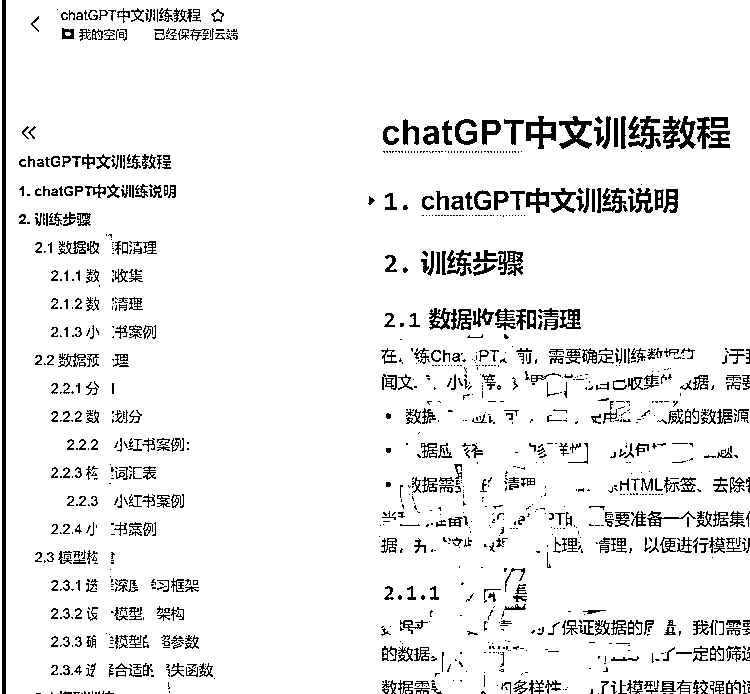

# ChatGPT 训练师，为企业定制专属的 ChatGPT

> 原文：[`www.yuque.com/for_lazy/xkrm14/ds3e0x2qa9w9z5yt`](https://www.yuque.com/for_lazy/xkrm14/ds3e0x2qa9w9z5yt)

<ne-p id="u426cda46" data-lake-id="u426cda46"><ne-text id="uce4b33ef">作者： 橙 Sir</ne-text></ne-p> <ne-p id="u61bfb39c" data-lake-id="u61bfb39c"><ne-text id="ud286429f">日期：2023-02-23</ne-text></ne-p> <ne-p id="ubb212582" data-lake-id="ubb212582"><ne-text id="u16ff5cc4">点赞数：</ne-text><ne-text id="ubd59c687" ne-bold="true">21</ne-text></ne-p> <ne-hole id="ue59e2ef7" data-lake-id="ue59e2ef7"><ne-card data-card-name="hr" data-card-type="block" id="oqw8Y" data-event-boundary="card"><ne-p id="ue2cd7fd9" data-lake-id="ue2cd7fd9"><ne-text id="u2791bfa2">正文：</ne-text></ne-p> <ne-p id="uaf87a501" data-lake-id="uaf87a501"><ne-text id="u60a25e58">ChatGPT 训练师，为企业定制专属的 ChatGPT，根据产品和服务进行私人定制，比如：公众号、小红书、朋友圈文案等。 这应该会是未来很长一段时间的应用。</ne-text></ne-p> <ne-p id="ub8b8fcf0" data-lake-id="ub8b8fcf0"><ne-card data-card-name="image" data-card-type="inline" id="gXthM" data-event-boundary="card">  <ne-hole id="u1fc28cc3" data-lake-id="u1fc28cc3"><ne-card data-card-name="hr" data-card-type="block" id="mPBzS" data-event-boundary="card"><ne-p id="u0f0a97e2" data-lake-id="u0f0a97e2"><ne-text id="u44ccee5c">评论区：</ne-text></ne-p> <ne-p id="u147fcf0c" data-lake-id="u147fcf0c"><ne-text id="uae7aa26b">田新一 : 这个在哪里看哇</ne-text></ne-p> <ne-p id="u5eb90665" data-lake-id="u5eb90665"><ne-text id="u52aa8a33">戴忻 : 同问</ne-text></ne-p> <ne-p id="u683da0b5" data-lake-id="u683da0b5"><ne-text id="uddd9eb78">谭铁铁 : 这个文档方便透露么 老板</ne-text></ne-p> <ne-p id="u2d572b7f" data-lake-id="u2d572b7f"><ne-text id="u53ab9842">yetu 耳 : 这个文档截图在很多群里看到过，就是没有人分享。估计是某位大神的付费课件。</ne-text></ne-p> <ne-hole id="ueb4518ad" data-lake-id="ueb4518ad"><ne-card data-card-name="hr" data-card-type="block" id="jlE9K" data-event-boundary="card"><ne-p id="u82687d37" data-lake-id="u82687d37"><ne-text id="u6425a61e">公众号懒人找资源，懒人专属群分享</ne-text></ne-p></ne-card></ne-hole></ne-card></ne-hole></ne-card></ne-p></ne-card></ne-hole>